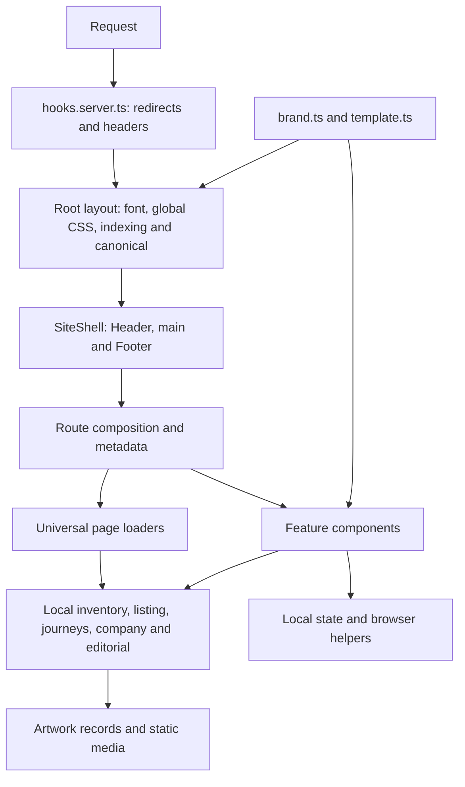

# Auto Best architecture audit and refactor plan

Date: 14 September 2026. Status: original audit complete; the Phase 3 CSS ownership slice and the R4/Phase 4 discovery-and-shell ownership slice were implemented and qualified on 15 September 2026. Other plan phases retain their original status.

Audited source: [`b54d366fa5a07c3bcced12ec6d8ece705c921e09`](https://github.com/darkapoparka/cars-template-auto-best/tree/b54d366fa5a07c3bcced12ec6d8ece705c921e09), on `main` in `darkapoparka/cars-template-auto-best`. The checkout was clean and matched `origin/main` after fetching. References and measurements below describe that source commit; later implementation must record its own evidence.

## Phase 3 implementation record - 15 September 2026

Phase 3 was implemented on `main` from baseline `977d59e5dbb4fc6c1f32f304342a36d6903c155b`, after confirming that local and `origin/main` matched. While qualification was in progress, the already-tested Phase 2 mobile-search commits `6ea812e` and `158b553` advanced both local and `origin/main`; Phase 3 was finalized on top of `158b553` without dropping those refinements. The requested legacy filenames `desktop-header.css` and `mobile-final-polish.css` were not present in this revision or its tracked history, so the audit followed the live CSS owners rather than recreating those obsolete layers.

Completed boundaries:

- `Header.svelte` now owns top-bar, desktop/mobile header, navigation and mega-menu geometry; the separate `navigation.css` layer was retired.
- `VehicleDiscoveryForm.svelte`, `ListingFilters.svelte`, `ListingResults.svelte` and `VehicleCard.svelte` own their respective desktop/mobile geometry. `listing.css` retains only listing-route stage and hero composition.
- `composition.css` retains shared shell/hero relationships and no longer identifies page semantics through incidental descendants.
- Explicit classes, typed route props, `data-route`, `data-contact-topic`, `data-journey`, `data-mobile-bottom`, `data-slot` and `data-variant` replace positional and class-substring selectors.
- `lead-site.ts` is the typed owner of Day & Night palette values and lead artwork. `SiteShell.svelte` exposes those values through semantic CSS custom properties; generic components consume configuration rather than dealer paths or conditionals.
- `check:css-policy` and the strengthened typography gate prevent fragile selectors, standalone-CSS `:global(...)`, unsupported `550`/`650` weights, typography `!important`, and dealer artwork/palette leakage.

Qualification completed with `npm run validate`, `npm run smoke` and `npm run smoke:typography`. Svelte checking reported 0 errors and 0 warnings; the warning-free production build passed. A 48-state final capture covered Home, inventory, vehicle detail, Import, Sell/Barter, About, Contact and Blog at 375, 390, 430, 768, 1366 and 1440 px. The critical ownership comparison found zero computed-style differences for header, discovery, filters, results grid and vehicle-card geometry at 375, 1024 and 1440 px.

This record closes only the Phase 3 slice. It does not silently mark unrelated R0-R7 work complete.

## Phase 4 implementation record — 15 September 2026

The safety inspection began with local `main` and `origin/main` both at `acb53c86e13a21ad8260250b946ac52506f23158`; the prompt's expected `f2fa776ba3cf19b7fc08499bb4c24f15561f91b4` was confirmed as an ancestor rather than assumed current. The working tree already contained substantial Phase 4 work plus unrelated brand-audit scratch files. That work was backed up and audited in place; no reset, checkout, force update or unrelated deletion was used. Before the first Phase 4 commit, the concurrent brand correction `8e08d79fd737fd8c825597348b86272138887e38` advanced `main`, and the Phase 4 commits were made on top of it. The later brand-only commit `c973641` is outside this phase.

The application implementation span is:

- `7350c2de0da49f9e82c58dade75c142e86545191` — consolidate discovery draft ownership.
- `bacbb41a3ff257b724d2fd0a034dca41e067f183` — centralize shell presentation ownership and add the focused Phase 4 browser suite.

### Implemented ownership

- `src/lib/data/listing-draft.ts` is the small typed, pure owner for filter/draft conversion, numeric normalization, empty-field cleanup, option retention and labels, range summaries, applied-chip labels, facet-entry preservation, and deterministic make/model transitions. It has no browser API, Svelte state or singleton session state.
- Applied listing state remains URL-owned through `listing.ts`. Home/desktop pending values remain in their form owner. Full-dialog and nested-picker drafts remain local to their dialog owner. Cancel never serializes a draft; nested Apply only updates the parent draft; outer Apply updates the URL.
- `QuickFilterSheet.svelte` now has an explicit discriminated contract for its two real modes: URL/application-owned and parent-draft-owned. The markup, dialog semantics, focus return and visual sheet are unchanged.
- `SearchBox.svelte`, `VehicleQuickSearch.svelte`, `VehicleDiscoveryForm.svelte`, `VehicleSearchDialog.svelte` and `ListingFilters.svelte` share the pure operations without being merged into a configurable mega-component. Compact Home search, desktop discovery and full inventory search remain separate presentations.
- `src/lib/data/shell.ts` is the pure route-presentation owner for route/topic classification, workflow/layout state, footer/mobile-bottom mode, navigation active/current state and the selected detail vehicle. The root layout derives that typed state once from `page.url` and `page.status`.
- `SiteShell.svelte` owns the footer element observation through a Svelte attachment and passes explicit state to `Header.svelte` and `Footer.svelte`. `Header.svelte` and `MobileMenu.svelte` no longer rediscover route meaning or look up the selected inventory record.
- `Header.svelte` was deliberately kept as the owner of its coupled desktop mega-menu, mobile-dialog and route-specific action lifecycle. The already separate `MobileMenu.svelte` remains the genuine mobile presentation boundary. A further line-count-only split was rejected because it would divide shared focus return, Escape, resize, route-transition and scroll-lock behavior without creating an independent state owner.
- No global store, state framework, Tailwind layer, override stylesheet, backend or new UI/icon system was introduced. No public route, query key, Bulgarian copy, fixture content, generated media or visual token was renamed or redesigned.

### Qualification and visual evidence

The exact implementation commit `bacbb41a3ff257b724d2fd0a034dca41e067f183` was checked in a clean detached worktree, separate from concurrent brand work. `npm run validate` passed all architecture, CSS-policy, token, typography, asset and expanded domain checks, `svelte-check` reported 0 errors and 0 warnings, and the production build completed with the Vercel adapter. `npx svelte-kit sync`, warning-failing `svelte-check`, `git diff --check`, `npm run smoke` and `npm run smoke:typography` are recorded in the final Phase 4 qualification below.

A production-preview comparison used exact parent `8e08d79` and exact Phase 4 implementation `bacbb41`. It captured Home, Inventory, Vehicle detail, Import, Sell/Barter, About, Contact and Blog at 390×844 and 1440×900, plus Home/Inventory/Detail at 767/768 and 991/992. All **28 of 28** matched screenshots were pixel-identical; all **28 of 28** geometry records matched; there were zero size mismatches and zero page/console errors. Additional browser coverage includes 320×677, 430×932, 844×390 landscape, 1024×900 and 1920×1080. Controlled Home/About checks also verified footer-visible mobile-dock state and restoration after returning to the top.

Final qualification resumed after a fresh fetch with local `main` and `origin/main` both at `c97364135ac8e86343ba9535e8b87a9e672f0add` and divergence `0 0`. The three existing Phase 4 documentation edits and concurrent brand-asset work were preserved in place. While qualification was underway, the scoped brand-only commit `fddb3f3314e3e3fb852830cef31f2090c7d82057` advanced both local and remote `main` without conflict; its five brand/provenance paths were inspected and left outside the Phase 4 patch. The application implementation still ends at `bacbb41a3ff257b724d2fd0a034dca41e067f183`, while `fddb3f3` is the exact final qualification base. The only additional Phase 4 source change is focused regression coverage in `scripts/phase4-smoke.mjs` for nested-picker Cancel ownership and viewport-specific assertion diagnostics.

A fresh isolated snapshot was created from `fddb3f3`, then overlaid with only the four task-owned documentation/test files. It used its own installed dependencies, build output and production-preview process so concurrent work in the live checkout could not replace `.svelte-kit/output`. In that snapshot, `npx svelte-kit sync`, `npx svelte-check --tsconfig ./tsconfig.json --fail-on-warnings`, `npm run validate`, `npm run smoke` and `npm run smoke:typography` all passed; the final task diff also passed `git diff --check`. Svelte diagnostics reported **0 errors and 0 warnings**; the Vercel adapter build completed; the full smoke chain passed route, journey, enquiry, mobile-filter, desktop-discovery and Phase 4 suites; typography/enquiry checks passed at 320, 390, 768 and 1440 plus 385×667/712/844 dock heights.

The focused suite now explicitly proves that nested picker Cancel leaves the parent draft and URL unchanged and restores focus to the picker trigger, before separately proving nested Apply, deterministic make/model reset and outer-dialog Cancel/Apply. The remaining Phase 4 cases cover pending desktop values, sort/chip preservation, filtered detail return, menu/contact active state, direct and client navigation, footer/mobile-dock/detail-bar transitions, duplicate IDs, horizontal overflow and keyboard ownership.

A final production candidate capture repeated all 28 representative route/breakpoint states with zero HTTP, console, page, broken-image, duplicate-ID, leaked-dialog or horizontal-overflow failures. The exact parent-to-implementation comparison remains 28/28 pixel-identical and 28/28 geometry-identical. One attempted preview in the active checkout was invalidated when a concurrent build replaced its shared `.svelte-kit/output` and removed a referenced CSS asset; the isolated production build and complete rerun passed, confirming this was build-output interference rather than an application regression.

Limits: browser automation used the installed Chromium channel on Windows; it does not establish physical iOS keyboard/share-sheet behavior. The sticky Popover API path was exercised in the supported browser used by the repository suite. This record closes only R4/Phase 4 and does not claim R5-R7 or unrelated R0-R3 findings complete.

## 1. Recommendation and scope

Retain the existing SvelteKit application and finalize its boundaries through incremental refactoring. The application already has native SSR, typed routes, reusable feature components, URL-driven inventory filters, local enquiry drafts, semantic typography tokens and useful checks. A framework migration or wholesale replacement would discard working structure without addressing the actual problems.

The principal work is to make dealer adaptation possible through documented content owners, give each interaction and style rule a clear owner, and make the verification commands trustworthy. The highest-priority starting point is repairing the stale enquiry test and capturing the current rendered contract before changing application code.

This plan covers rendering, dependency direction, configuration, inventory and editorial data, routes, navigation, discovery, enquiries, browser resources, CSS, media, metadata/security, testing, tooling, documentation and Cars compatibility. It proposes implementation inside this reusable master. Dealer publication, real enquiry delivery and promotion of a Cars snapshot remain separately qualified operations.

### Existing constraints to preserve

- Work in the saved checkout on `main`, with one writer and scoped commits. Preserve concurrent changes and fetch before writing/pushing.
- Keep Svelte 5, SvelteKit 2, TypeScript, Vite, the Vercel adapter, Node 22.12+ within the 22 line, and the npm lockfile. Upgrades require a separate reason.
- Preserve Bulgarian copy, euro prices, kilometres, self-hosted Onest, existing artwork, responsive composition, focus behavior and the relative emphasis of current actions unless a specific change is approved.
- Keep the public routes, numeric record IDs, query keys, return anchors and legacy redirects. Internal extraction does not authorize URL renaming.
- Retain preview/noindex defaults and sample-content restrictions. Copy/share remains a browser-local handoff, with no claim of delivery to a business.
- Keep transparent `brand.logo` and `brand.logoOnDark` variants selected for the actual background. Preserve hit areas and focus indicators; do not introduce decorative logo boxes.
- Keep dealer-editable ownership under `src/lib/config/`, `src/lib/data/`, `src/lib/styles/tokens.css` and `static/`. Preserve source notices and provenance.

### Outside the refactor

No CMS, database, authentication, CRM, mail provider, inventory scraping, VIN decoding, payment service, translation framework, new gallery feature, multi-tenant runtime, monorepo conversion or generic page builder is required. No blanket asset renaming, `dn-` prefix replacement or dependency refresh belongs in these phases. These are scope limits, not claims that future clients will never need integrations.

## 2. Evidence and verification boundary

The audit inventoried every tracked application module, resolved static imports from route/application entry points, reviewed every route and loader, inspected stateful components and their browser lifetimes, parsed stylesheet declarations, and inspected configuration, scripts, deployment inputs and primary documentation. Simple presentation components were assessed through their imports, props and style ownership; this is an architecture audit, not a new visual acceptance report.

| Measurement | Observed at the audited commit |
| --- | --- |
| Tracked files | 306 |
| Application source files | 102 `.svelte`, `.ts`, `.css` and `.html` files under `src/` |
| Svelte files | 65 total: 56 library components and 9 route/layout/error components |
| Page routes / loaders / endpoints | 7 page routes, 5 universal page loaders, 2 HTTP endpoints |
| Source size | Approximately 16,295 lines, including blank lines |
| Static import reachability | 99 of 102 source files reachable from application/route roots; no cycles found |
| Inventory | 8 sample records |
| Static media | 117 files, 13,571,286 bytes; 104 distinct source-referenced public assets |
| Styles | 2,418 parsed rules, 8,443 declarations, 947 hex/RGB color occurrences outside `tokens.css` |
| Toolchain resolved by lockfile and installed tree | Svelte 5.57.0; SvelteKit 2.70.3; Vite 8.2.2; TypeScript 5.9.3; adapter-vercel 6.3.4; Playwright 1.62.1 |
| Local command runtime | Node 22.22.0; npm 10.9.4, while `packageManager` declares npm 10.9.8 |

Import reachability includes static type imports and conditional component imports; it is not a production bundle analysis. The CSS count includes repeated values, gradients and decorative treatments; it is not a count of visual defects. Source size alone is not a reason to split a component.

### Checks performed for this audit

| Check | Result and limit |
| --- | --- |
| `npm run check:architecture` | Passed across 103 application/configuration files; current guard is a source-string check |
| `npm run check:typography` | Passed: 1,083 declarations use shared tokens or inheritance |
| `npm run check:assets` | Passed: 117 media files and 104 referenced public assets |
| `npm run check:domain` | Passed for the 8 records and current filter/context/CSS-variable assertions |
| Installed `svelte/compiler` server compilation of all tracked `.svelte` files | All 65 compiled with no compiler errors or warnings; no generated files were written |
| Svelte autofixer on `VehicleSearchDialog.svelte` | No issues or suggestions; advisory analysis of that component only |
| Static import analysis and PostCSS parsing | No import cycles found; no stylesheet parse errors |
| `lockPageScroll()` characterization | Reproduced unsafe overlapping-owner release with the actual transpiled helper and a fake document; see A06 |

Full Svelte/TypeScript checking with `npm run check`, production build, browser smoke, screenshot review, hosted behavior and Cars packaging were **not run** for this documentation change. Compiler-only success is not TypeScript/build/browser success. Existing listeners occupied 6461 and 5173, but process command lines were unavailable, so their checkout ownership could not be confirmed. The audit did not reuse those listeners or write to shared build output. Existing ignored artifacts are not current acceptance evidence.

No tracked GitHub Actions workflow exists in this commit; `.github/` contains Copilot instructions. GitHub repository settings, required checks, provider availability and private source-license evidence were not audited.

## 3. Current architecture



The diagram shows runtime collaboration; import direction is reviewed separately below. In particular, `template.ts` currently imports inventory, which is one of the boundaries to change.

| Area | Current owner and assessment |
| --- | --- |
| Rendering | `app.html`, `routes/+layout.svelte`, `layout/SiteShell.svelte`; native SvelteKit SSR and navigation, with no legacy HTML composition runtime |
| Shell | `Header.svelte` combines desktop navigation, mega menu, mobile menu lifecycle, route classification, detail actions and footer visibility observation |
| Brand/config | Typed public modules; transparent logo variants exist, but favicon, coordinates, service claims and some identity-bearing artwork remain separate |
| Catalog | `inventory.ts` combines entity types, sample records, derived display fields, formatting and detail URLs; most catalog consumers import this module |
| Discovery | `listing.ts` owns useful parser/serializer/matcher functions; full search, compact home search, quick sheets and desktop forms maintain overlapping draft machinery |
| Editorial | `editorial.ts` owns local posts and filters; loaders calculate related posts/categories/tags; homepage editorial derives from the same records |
| Enquiries | Contact dispatches trade-in to `TradeInEnquiry` and import to `VehicleEnquiry kind="import"`; both own local summaries, contact inputs, steps and sharing behavior |
| Browser lifecycle | Some scroll helpers are shared; several dialogs implement their own focus, scroll offsets, body CSS and teardown |
| Styling | Ordered global imports plus component styles and route CSS; typography ownership is strong, but navigation/contact ownership crosses these layers |
| Media | Dedicated artwork modules and rendering helpers preserve measured bounds/crops; some image maps and literal paths remain inside components |
| HTTP/SEO | A server hook supplies redirects/security headers; root layout, robots and sitemap each participate in publishing/indexing behavior |
| Verification | Native Node scripts, TypeScript transpilation for three domain modules, and Playwright scripts; no automated server lifecycle or tracked CI workflow |
| Release | Vercel builds this app; Cars owns approved commit selection, dealer copies and mounted packaging |

The static import graph is acyclic. High fan-in alone is expected for primitives: `Icon.svelte` has 30 importing files, `brand.ts` 29 and `inventory.ts` 19, including type imports. Preserve shared primitives; reduce the catalog/config coupling where it changes responsibilities or bundle composition.

## 4. Findings and priorities

Priority here is implementation order/readiness impact. **P1** must be addressed before calling the architecture finalized. **P2** belongs in the bounded cleanup and qualification phases. A source finding is not a claim that a visitor failure was reproduced in a browser.

### A01 — P1: The default enquiry smoke test targets the retired flow

Evidence: [enquiry-smoke.mjs](../scripts/enquiry-smoke.mjs), [ContactIntent.svelte](../src/lib/components/company/ContactIntent.svelte), [TradeInEnquiry.svelte](../src/lib/components/company/TradeInEnquiry.svelte), [VehicleEnquiry.svelte](../src/lib/components/company/VehicleEnquiry.svelte), [package.json](../package.json).

The test opens `/contact?topic=trade-in`, searches for `Предложи автомобил`, and then selects `.dn-enquiry`. The actual route renders `TradeInEnquiry`, whose entry action is `Заяви оценка` and dialog is `.dn-tradein-dialog`. Its import section also expects the former inline `#enquiry-listing-link` field; the current entry uses `EnquiryEntryField`. This is a confirmed source/test mismatch, not an executed smoke-test failure.

`npm run smoke` includes this suite, while the newer, substantially relevant `typography-smoke.mjs` is separate. Consequently, a working test baseline must precede architectural extraction. Update the tests to preserve their behavioral assertions, including photo handling and no server submission; do not restore old UI merely to satisfy stale selectors.

### A02 — P1: Config and sample inventory prevent data-only publishing

Evidence: [template.ts](../src/lib/config/template.ts), [inventory.ts](../src/lib/data/inventory.ts), [root layout](../src/routes/+layout.svelte).

`inventoryRecords` excludes `verification` from its input type, and the mapper stamps every exported record as `sample`. `canIndex()` requires every record to be verified with evidence. A dealer therefore cannot publish by supplying verified records and settings alone: it must edit implementation logic. The safeguard is valuable; the input contract is incomplete.

`template.ts` also imports the complete catalog, and `canIndex()` both determines indexing and throws configuration errors. The root client-capable layout imports it. Split public presentation settings from validation/orchestration, permit record-level evidence in input records, and retain fail-closed published validation. Verification flags cannot themselves establish the truth of business claims.

### A03 — P1: Inventory semantics are inferred from presentation strings

Evidence: [inventory.ts](../src/lib/data/inventory.ts), [listing.ts](../src/lib/data/listing.ts), [detail loader](../src/routes/listing-detail-v1/%5Bid%5D/+page.ts).

Model options remove a make prefix from `title`; matching model and version searches title substrings. `Mercedes-AMG` titles do not have the configured `Mercedes-Benz` prefix. Price/year/mileage/version options include fixture-specific arrays. Entity data, formatted labels and detail destinations share one exported record shape, and `featuredVehicles` is also the entire catalog.

Introduce explicit model/version fields and separate pure vehicle operations from record content. Preserve the existing URL interpretation during migration, including title-derived model values in old links. Catalog options should derive from supplied records or a deliberate facet configuration. Empty stock and additional records must not require component or checker edits.

### A04 — P1: Brand adaptation has several uncoordinated owners

Evidence: [brand.ts](../src/lib/config/brand.ts), [company.ts](../src/lib/data/company.ts), [app.html](../src/app.html), [detail page](../src/routes/listing-detail-v1/%5Bid%5D/+page.svelte), [RouteHeroArtwork.svelte](../src/lib/components/ui/RouteHeroArtwork.svelte), [Reuse guide](../REUSE_GUIDE.md).

The template has an Auto Best wordmark but inherited contact/social records, separate map coordinates and a separately selected favicon. The detail page has literal `Auto Best` accessible copy. Some artwork is source-specific or contains text in its pixels. Service claims are repeated across metadata, navigation, footer, home actions and company data.

Complete the typed personalization map: identity/location/icons, services and editable campaign/SEO copy need documented owners. Keep source/sample content explicitly classified. Do not make decorative image filenames appear to be verified business evidence, and do not assume changing `brand.name` personalizes image pixels.

### A05 — P1: Two enquiry implementations retain duplicated and unreachable branches

Evidence: [ContactIntent.svelte](../src/lib/components/company/ContactIntent.svelte), [TradeInEnquiry.svelte](../src/lib/components/company/TradeInEnquiry.svelte), [VehicleEnquiry.svelte](../src/lib/components/company/VehicleEnquiry.svelte), [EnquiryEntryField.svelte](../src/lib/components/company/EnquiryEntryField.svelte).

Trade-in has its own component, but `VehicleEnquiry` still exposes a trade-in branch and duplicates photo validation, object URL management, copy/share fallbacks and summary generation. The inspected application call site uses it only for import. Long compressed markup/style lines also hide the real size of these files: each enquiry component is roughly 28 KB despite being under 400 lines.

Rename the actual import flow to `ImportEnquiry` during its migration, remove its unused selling branch after reference/compatibility checks, and keep two explicit workflows. Extract shared pure validation/summary operations and browser photo/handoff helpers. A configurable universal wizard would add unnecessary state combinations.

### A06 — P1: Dialog resource ownership is fragmented

Evidence: [overlay.ts](../src/lib/ui/overlay.ts), [dialog-viewport.ts](../src/lib/ui/dialog-viewport.ts), [VehicleSearchDialog.svelte](../src/lib/components/listing/VehicleSearchDialog.svelte), [QuickFilterSheet.svelte](../src/lib/components/listing/QuickFilterSheet.svelte), the three enquiry/editor components, and both workflow information drawers.

The shared scroll lock saves and restores `body.style.overflow` independently for each owner. A characterization of the actual helper produced this sequence: acquire A, acquire B, release A => overflow becomes empty while B remains active; release B => overflow stays `hidden`. Only the header currently imports this specific lock, so this proves the helper is unsafe to expand to overlapping consumers, not that this sequence currently occurs in the UI.

Other dialogs combine per-component CSS `body:has(...)` locks, custom scroll properties, native close behavior and different cleanup paths. Information drawers duplicate drag thresholds and pointer capture logic. Adopt one resource controller with idempotent release, nested-dialog support, explicit focus return and navigation/unmount handling. Retain the existing visual differences and the already useful visual-viewport attachment.

### A07 — P1: CSS ownership crosses component and route boundaries

Evidence: [composition.css](../src/lib/styles/composition.css), [navigation.css](../src/lib/styles/navigation.css), [contact.css](../src/routes/contact/contact.css), [ContactIntent.svelte](../src/lib/components/company/ContactIntent.svelte), [TradeInEnquiry.svelte](../src/lib/components/company/TradeInEnquiry.svelte).

`composition.css` and `navigation.css` both define navigation/header selectors. `contact.css` is 1,274 lines and styles internals of enquiry/contact children. `TradeInEnquiry` uses global ancestor selectors to hide/change its parent contact composition. Shell dock hiding and scroll treatment also depend on descendant selectors spread through several components.

Assign structural decisions to the parent and internal presentation to the component. Move winning declarations with their responsive conditions intact, compare rendered output, then delete superseded rules. Do not add another override sheet or globally introduce cascade layers without measuring the specificity change.

### A08 — P2: Typography is centralized; colors and shared geometry are not

Evidence: [tokens.css](../src/lib/styles/tokens.css), [base.css](../src/lib/styles/base.css), stylesheet audit in section 2.

The typography guard passes and should remain. Color roles still include repeated literals such as `#fff`, `#202329` and `#24272c` across components. Not every similar shade has the same visual role. Of 19 `!important` declarations, 9 are the screen-reader-only utility; their presence is not itself a defect.

Add semantic color/surface/control tokens only where repeated roles are established. First preserve exact values, then consider visual changes separately. Retain legitimate accessibility overrides and local art-direction geometry. Breakpoint behavior at 767/768 and 991/992 needs shared documentation, not forced replacement with one breakpoint.

### A09 — P2: The shell owns unrelated interactions and sibling discovery

Evidence: [Header.svelte](../src/lib/components/layout/Header.svelte), [SiteShell.svelte](../src/lib/components/layout/SiteShell.svelte), [Footer.svelte](../src/lib/components/layout/Footer.svelte), [root layout](../src/routes/+layout.svelte).

Header is 768 lines with 213 script lines. It owns several navigation surfaces, classifies routes/topics, resolves selected vehicles again, manages dialogs and finds `#dn-site-footer` on mount to observe a sibling. Root layout independently computes footer variants. These are responsibilities, not merely a file-length concern.

Have the shell own route presentation and footer visibility, pass typed state to navigation components, and extract desktop navigation/mobile actions along their actual interaction boundaries. Use an owned element callback/attachment for footer observation. Preserve mega-menu keyboard behavior, active destinations, detail actions and route-transition cleanup.

### A10 — P2: Discovery repeats draft-to-filter mechanics

Evidence: [VehicleQuickSearch.svelte](../src/lib/components/home/VehicleQuickSearch.svelte), [VehicleSearchDialog.svelte](../src/lib/components/listing/VehicleSearchDialog.svelte), [VehicleDiscoveryForm.svelte](../src/lib/components/listing/VehicleDiscoveryForm.svelte), [QuickFilterSheet.svelte](../src/lib/components/listing/QuickFilterSheet.svelte).

The full dialog and compact search duplicate field initialization/reset, numeric conversion, option labeling and dependent make/model handling. Several forms duplicate empty-field cleanup. `QuickFilterSheet` switches between URL-backed application and parent-draft application through optional props. `VehicleDiscoveryForm` uses a popover for its sticky presentation, which needs explicit lifecycle/browser qualification.

Extract a typed draft model and facet descriptions while retaining distinct home, desktop and full-search presentations. Make the sheet's ownership mode explicit. Preserve applied URL state versus pending desktop form values versus modal drafts; flattening these into one store would change current behavior.

### A11 — P2: Media validation freezes the source snapshot

Evidence: [check-assets.mjs](../scripts/check-assets.mjs), [artwork data](../src/lib/data/vehicle-artwork.ts), [asset reference](../ASSET_PROVENANCE.md).

The checker requires exactly 117 static media files and exactly 117 referenced-or-retained paths. Adding/removing legitimate dealer assets changes the expected count and requires editing the checker. Reference scanning also treats a path inside an unreachable module as used, and does not validate dimensions/crop semantics or provenance classification.

Replace the global count with reference integrity and an explicit retention manifest. Keep an optional source-snapshot integrity check separately from reusable validation. Validate positive source dimensions, visible bounds and crop tuples according to their distinct meanings; negative crop origins can be intentional. Preserve the recently optimized WebP assets and the notices for archived media.

### A12 — P1: Security/indexing checks lack executable contract coverage

Evidence: [hooks.server.ts](../src/hooks.server.ts), [template.ts](../src/lib/config/template.ts), [robots endpoint](../src/routes/robots.txt/+server.ts), [sitemap endpoint](../src/routes/sitemap.xml/+server.ts), [check-domain.mjs](../scripts/check-domain.mjs), [route-smoke.mjs](../scripts/route-smoke.mjs).

CSP is hand-built in the hook with inline script allowances and unrestricted WebSocket schemes. This is a hardening opportunity, not a demonstrated exploit. Publishing validation is not exercised by the domain suite; redirect/security-header and robots policy assertions are also absent from the inspected runtime scripts. The route suite obtains detail cases from the sitemap, so a sitemap omission can remove its own detail-page test coverage.

Use independent expected route/record sets for endpoint tests. Centralize publishing validation and keep the intentional preview sitemap behavior explicit. For CSP, use the installed framework's nonce/hash support, prove production hydration/embeds, and scope development WebSockets separately. Inline style policy needs a separate compatibility decision because artwork and viewport helpers use dynamic styles. SvelteKit documents these capabilities and transition limitations in its [CSP configuration](https://svelte.dev/docs/kit/configuration#csp).

### A13 — P2: Tests and tooling do not form one reproducible release gate

Evidence: [package.json](../package.json), [browser.mjs](../scripts/browser.mjs), [check-domain.mjs](../scripts/check-domain.mjs), [Testing](TESTING.md), [.github](../.github).

`quality` assumes an already running server; `BASE_URL` is mandatory and `previewUrl()` reduces it to an origin. That is adequate for standalone-root tests and unsuitable as proof of a mounted path. Domain compilation explicitly lists three modules and rewrites their relative imports. The architecture guard rejects legacy strings but does not enforce import direction. `home-hierarchy-smoke` and `smoke:typography` are outside the aggregate chain. No CI workflow is tracked.

Establish one suite manifest, a controlled owned-server lifecycle, reusable domain test loading, and an import-boundary check. Keep tests for behavior and accepted geometry; replace stale fixture counts only where they prevent legitimate content changes. Pin the intended npm patch in local/CI setup without refreshing dependencies for this task. CI configuration and actual successful execution are separate evidence.

### A14 — P2: Documentation describes several source eras as current

Evidence: [Components](COMPONENTS.md), [Data](DATA.md), [Deployment](DEPLOYMENT.md), [Development](DEVELOPMENT.md), [Reuse](../REUSE_GUIDE.md), [.template metadata](../.template/template.json).

Components describes `TradeInEnquiry`, `MobileCoreActions` and other tracked files as working-preview additions absent from standalone source. Reuse says the footer is dark and uses `logoOnDark`; current `Footer.svelte` defines a light surface and uses `brand.logo`. Development still identifies the Cars snapshot as the reviewed development copy. Historical `.template` versions and scores are acquisition metadata, not new release evidence.

Reconcile current implementation documents during their corresponding slices. Preserve historical provenance without treating it as an active source contract. Keep this plan as the execution ledger until completed, and update `ARCHITECTURE.md` to the resulting implementation rather than maintaining two competing architecture references.

### A15 — P2: There are concrete candidates for removal and tighter module APIs

Static imports found no application-root path to `company/TeamSocialIcon.svelte`, `company/WorkflowShowcase.svelte` or `home/MobileBudget.svelte`. These are removal candidates, not authorization for blind deletion: check Cars packaging and any intentional source-only retention first. Conditional demo-team/partner components remain reachable and should not be confused with dead files.

Other cleanup includes the unused selling branch described in A05, duplicate naming of `Vehicle` for catalog records and decorative artwork keys, literal casts such as a dynamic vehicle href cast to `'/listing-detail-v1/1'`, and article-loader fields calculated without a current page consumer. Prefer `VehicleArtworkKey`, typed path helpers, and narrow loader results. Remove unused exports only after checking actual imports and relevant packaging assumptions.

### A16 — P2: Performance and external behavior need measured qualification

Source currently imports local inventory into discovery and shell-related paths, imports complete local articles into universal loaders, and eagerly prioritizes several initial cards. Maps are lazy iframes; videos instantiate a privacy-enhanced YouTube iframe after activation. Neither source size nor the total static-media directory measures the bytes a visitor downloads.

Capture per-route JS/CSS, image/font requests, hydration errors and responsive artwork selection before changing loading. Reduce demonstrated eager work and unnecessary catalog reachability. Preserve lazy loading and direct provider links; add deterministic unavailable-provider cases. Do not promise live Google/YouTube availability from mocked tests or introduce a backend just to optimize eight fixtures.

## 5. Target boundaries

These are proposed ownership decisions for implementation, not claims about existing files. Retain existing paths where possible and add modules only for the concrete separations below.

### Dependency rules

1. Public configuration supplies values and types; it must not import catalog records, routes, components or browser APIs.
2. Pure data/domain functions accept explicit inputs. They may import types and other pure helpers, but not `$app/state`, Svelte components, browser APIs or provider secrets.
3. Content modules contain records and declared presentation copy; they may compose pure functions. Keep fixture records out of reusable validators.
4. Routes/loaders compose content and domain functions into page data. Components receive typed feature data and own local interactions; small shared public content imports remain acceptable.
5. Browser helpers own DOM resources and return cleanup. They do not choose business topics, navigate on behalf of a form, or send an enquiry implicitly.
6. Server orchestration owns published validation and response policy. Only public derived state reaches client layouts. Add provider code under a server-only boundary only when separately requested.
7. Parent layout owns whether a child/header/action is present. Child CSS must not reach upward to change its parent or sideways to hide a sibling.
8. Cars packaging owns mounted compatibility; the master keeps its standalone route contract. New module/path shapes require compatibility review before promotion.

### Proposed module map

| Owner | Final responsibility / proposed change |
| --- | --- |
| `config/brand.ts` | Public identity, transparent logo variants, icon references and coherent location/contact settings; retain current exported entry |
| `config/template.ts` | Public mode, canonical origin, optional-section and service settings; remove catalog imports |
| `data/vehicles.ts` — proposed | Vehicle input/output types, formatting, validation and selectors accepting records |
| `data/inventory.ts` | Dealer-owned records and assembly; preserve current exports as temporary compatibility facades during migration |
| `data/listing.ts` | Pure URL parsing/serialization, matching/sorting, range validation and option derivation from supplied inputs |
| `data/listing-draft.ts` — proposed | Typed draft conversion/reset/dependent transitions; no DOM or singleton session state |
| `data/journeys.ts` | Safe list returns and typed contact/detail destinations; selected-record lookup accepts the catalog |
| `data/company.ts`, `navigation.ts`, `home.ts` | Service/content composition through one set of configured service destinations and labels |
| `data/editorial.ts`, `videos.ts` | Canonical article/video records and intentional editorial selection; split pure helpers only where tested reuse warrants it |
| `data/enquiry.ts` — proposed | Distinct import/trade-in payloads, validation and summary formatting; no `File`, object URLs or navigator calls |
| `data/vehicle-reference.ts` | Shared URL/VIN-reference normalization; syntax only, with no fetch/decode behavior |
| `data/publishing.ts` — proposed | Pure validator returning actionable configuration/record errors; independent of global fixture imports |
| `server/publishing.ts` — proposed | Assemble configured public inputs and enforce published readiness; expose a small layout/indexing result |
| `ui/dialog.ts` and `overlay.ts` — proposed consolidation | Owned native dialog lifecycle, nested locks, focus and cleanup; reuse `dialog-viewport.ts` |
| `ui/enquiry-photos.ts`, `enquiry-handoff.ts` — proposed | Local file/object-URL lifecycle and explicit copy/share results, used by the existing flows |
| `components/layout/` | Shell, desktop navigation, mobile navigation/actions and footer, with typed inputs and owned visibility observation |
| `components/company/TradeInEnquiry.svelte`, `ImportEnquiry.svelte` | Two explicit user journeys; compose shared entry fields/resource helpers without a generic wizard engine |
| `components/listing/` and `components/home/VehicleQuickSearch.svelte` | Distinct responsive presentations sharing facet/draft operations |
| `components/vehicles/` | Vehicle cards and bounded detail sections; pure finance calculation moves out of markup while its existing disclaimer/behavior stays |
| `components/ui/` and artwork data | Existing action/icon/artwork primitives, typed dimensions/bounds/crops; rename artwork key types to avoid entity collisions |
| `styles/tokens.css`, `base.css`, `navigation.css`, `composition.css` | Semantic values, base utilities, intentional shared navigation rules and page composition respectively; prune cross-owner overrides |
| Repository-root `scripts/`, proposed `tests/` | Real module tests, HTTP contracts, UI journeys and release orchestration; no duplicate application logic |

Application paths in this table are relative to `src/lib/`; grouped filenames share the first filename's directory. The proposed files are a decomposition guide; do not create empty modules or permanent forwarding layers. A facade exists only until its consumers and Cars assumptions have been migrated in a reviewed slice.

### State and integration contracts

| State / input | Owner and acceptance rule |
| --- | --- |
| Applied inventory/blog filters | URL; reload, copy/paste and browser back reproduce results |
| Pending desktop form values | Owning form; opening full search sees the pending values without silently applying them |
| Main and nested filter drafts | Owning dialog; nested Apply updates its parent draft, Cancel preserves the previous value, outer Apply updates the URL |
| Import/trade-in drafts | Component instance; close/reopen retains the current draft, explicit context changes have tested reset behavior |
| Photo previews | Browser helper instance; removal, reset and unmount revoke each URL once; no persistence or upload is added |
| Menu/dialog visibility | Component/controller; route changes and resize release owned resources, nested close affects only the active surface |
| Finance inputs | Current vehicle interaction; switching vehicle resets its inputs; no lending offer is implied |
| Published/indexable status | Validated configuration and record evidence; preview is safe by default and invalid published settings fail before release |
| External listing URL | Normalized HTTP(S) reference without credentials; never fetched by the template |
| Copy/share result | Explicit copied/shared/cancelled/unsupported/failed result; none means confirmed business delivery |

SvelteKit can reuse component instances across navigation. Context updates therefore require an explicit reset/preservation contract rather than an assumption that navigation remounts everything. Keep request-specific state out of shared server modules, following the framework's [state-management guidance](https://svelte.dev/docs/kit/state-management). Universal and server-only loading have different execution boundaries; retain universal loading where appropriate and move only demonstrated server concerns, as described in [SvelteKit loading](https://svelte.dev/docs/kit/load).

## 6. Ordered implementation plan

All phases are **not started**. Each phase should produce small reviewed commits on `main`, with its evidence recorded here or linked from ignored artifacts plus a concise committed result. Application extraction and intentional visual changes should be separate commits. A phase is complete only when its stated acceptance checks pass.

| Phase | Depends on | Main findings | Intended commit slices |
| --- | --- | --- | --- |
| R0 — Establish a trustworthy baseline | None | A01, A13, A14 | Repair current journey selectors; suite inventory; baseline evidence |
| R1 — Finish content and domain ownership | R0 | A02, A03, A04 | Vehicle schema; pure listing/journey helpers; configuration/publishing inputs |
| R2 — Unify browser resource ownership | R0 | A06 | Scroll/dialog controller; nested search migration; enquiry/info/finance migration |
| R3 — Separate enquiry workflows | R1, R2 | A05 | Pure payloads/handoff; import-only component; trade-in migration |
| R4 — Consolidate discovery and shell state | R1, R2 | A09, A10 | Draft/facet helpers; responsive presentations; shell/navigation extraction |
| R5 — Consolidate styles and media | R3, R4 | A07, A08, A11, A15 | Parent/child CSS ownership; role tokens; asset integrity; verified dead-code removal |
| R6 — Qualify HTTP, metadata and performance | R1–R5 | A12, A16 | Publishing/SEO contracts; framework CSP; measured loading improvements |
| R7 — Close architecture and qualify release | R0–R6 | A13, A14, A15 | CI/server harness; current docs; exact-commit standalone evidence; Cars handoff |

R1 and R2 have independent conceptual prerequisites, but the saved checkout still has one writer. The table is not permission to run concurrent source writers or competing builds.

### R0 — Trustworthy tests and visual baseline

**Change:** Update `enquiry-smoke.mjs` for the actual trade-in and import interfaces. Bring relevant current typography/entry tests and home hierarchy coverage into an explicit suite inventory; inspect the latter's fixed body/brand counts before including it. Share suite selection rather than copying the assertions. Reconcile only the documentation needed to describe this current baseline.

**Acceptance:** Both current enquiry journeys pass their validation, review, back/edit, close/reopen and photo/copy/share cases against an identified source server. Assertions still prove no application submission occurs. Full main/nested filter behavior and route returns have a current baseline. Capture page and modal states at 390 and 1440, plus the boundary cases in section 7, with fonts loaded and stable scroll positions. Record existing failures precisely; do not call them refactor regressions later.

**Verification:** Four static/domain checks, `npm run check`, production build, repaired `npm run smoke`, `npm run smoke:typography` and a reviewed home hierarchy suite. Establish exclusive build-output ownership before running sync/build. Record the exact revision, source dirtiness, runtime PID/command and target identity.

### R1 — Content, catalog and URL domain

**Change:** Introduce an explicit input schema with model/version and record verification. Preserve sample defaults and current IDs/images/prices. Move pure vehicle operations out of the fixture module and parameterize listing/journey selectors. Centralize service destinations/copy and coherent brand/location/icon inputs. Separate publishing validation from settings and from request rendering.

**Acceptance:** A sample inventory and a second synthetic dealer fixture both validate without editing component or checker logic. Cover empty stock, one record, additional makes, zero/unknown facets, invalid IDs, invalid evidence and optional social/service data. Valid verified input can satisfy published validation; sample data cannot. Existing filter bookmarks, inclusive numeric bounds, repeated equipment keys and safe return URLs retain their meaning. Make/model changes have deterministic reset rules.

**Verification:** Table-driven tests of the real parser/serializer/matcher/validator, including malformed numbers, reversed ranges, evidence URLs and origin shape. Browse home → filtered inventory → detail → contact → filtered return. Confirm title/price/metadata and discovery counts still derive from the selected records. Keep legacy model strings readable during the explicit-model transition.

### R2 — Dialog and resource controller

**Change:** Implement one owned dialog/scroll/focus utility. It captures page state once for the first active owner, restores after the last owner, and handles release in either order. Migrate full search and its nested sheet first, then menu, entry editor, enquiry dialogs, information drawers and finance/import sheets. Reuse existing native dialogs and markup initially; extract repeated sheet presentation only after two migrated consumers demonstrate the same contract.

**Acceptance:** Open/close/reopen, Escape, backdrop, nested Apply/Cancel, resize, route navigation and unmount all release exactly their resources. The helper characterization in A06 passes with overlapping owners. Page offset is preserved without jumping after navigation. Focus returns to a connected trigger or an explicit fallback. Keyboard opening reduces usable viewport without hiding primary actions. Object URL handling remains the photo helper's responsibility.

**Verification:** Controller tests and browser behavior at small phone, normal phone, landscape, tablet and desktop sizes. Check Tab/Shift+Tab, body/html styles, safe-area spacing, dock visibility, no focus escape into an inactive surface, and no leaked observer/listener or pointer-capture state. Capture stacked search and editor states before/after.

### R3 — Explicit import and trade-in workflows

**Change:** Add typed payload/summary/validation functions and shared browser handoff/photo helpers. Rename `VehicleEnquiry` to `ImportEnquiry` and remove its unused selling path after call-site/packaging inspection. Trade-in keeps its VIN/listing/manual entry and photos; import keeps listing/criteria entry. Keep the existing entry-field component and current user-facing copy unless a specific correction is necessary.

**Acceptance:** A workflow's reference, fields, review and copied/shared text agree. Editing/clearing a listing, changing import mode, changing the incoming `vehicle_url`, navigating between contact topics and reopening a draft follow the documented state rules. Import exposes no trade-in photo controls. Six-photo/type/size/deduplication behavior remains; removed or abandoned previews are released. Abort/unsupported/permission failures are understandable and never presented as successful delivery.

**Verification:** R0 journey tests plus real-module summary/validation tests, failed clipboard/share fixtures, and same-route query navigation. Verify no enquiry POST/upload, no local persistence and no VIN/ad fetch. Keep native device share-sheet qualification separate from mocked capability tests.

### R4 — Discovery and shell decomposition

**Change:** Share draft conversion, facet labels/options and make/model transitions. Give quick-sheet URL and parent-draft modes explicit typed contracts. Keep compact home and full inventory composition distinct. Move route/footer presentation decisions to the shell and split navigation by its desktop/mobile/detail responsibilities. Pass selected vehicle context rather than searching the catalog again in a purely presentational header.

**Acceptance:** Same input filters yield the same count, serialized URL and visible values across entry points. Cancel never commits a draft. Sort retains active facets; chip removal preserves unrelated state. Footer/dock transitions use owned references and maintain page-end spacing. Mega menus, mobile active links, contact topic links and detail actions retain their destinations and keyboard behavior. No duplicate control IDs arise when composing discovery surfaces.

**Verification:** Domain roundtrips, mobile-filter and desktop-discovery suites, navigation/return suites, and direct versus client-side transitions. Test 767/768 and 991/992 explicitly. Confirm sticky popover appearance, dismissal and fallback in the supported browser set.

### R5 — CSS, media and reachable source

**Change:** Resolve contact styling by moving child internals to their actual component and parent decisions to route/composition markup. Consolidate navigation rules into one chosen owner. Retain `tokens.css` as the semantic value owner; map repeated colors to exact-value roles before changing their appearance. Move component-owned image maps into the artwork/content boundary and replace the fixed asset count with reference/retention validation. Review A15 removal candidates and any exports/styles made redundant by earlier phases.

**Acceptance:** No enquiry child hides/recolors its parent through global ancestor selectors. Shared tokens do not introduce new shades or geometry. Native focus/reduced-motion/forced-color behavior remains. A second dealer can add/remove photos, replace both logos and disable optional content without changing validation source. All runtime assets exist, dimensions/crops remain valid, and provenance-only media stays recorded. No source is deleted solely because of a regex hit.

**Verification:** Typography/assets/domain checks; direct load plus Home → Contact → Inventory → Detail → Back navigation to catch style-order regressions; screenshot comparisons for every affected surface at phone/desktop and breakpoint edges. Verify logo transparency/contrast on actual surfaces, especially the current light footer and dark header overlays. Keep the existing WebP optimization; measure network behavior before further changes.

### R6 — HTTP, indexing, CSP and measured loading

**Change:** Make publishing validation callable during qualification/build and expose one validated metadata policy to layout, robots and sitemap. Keep all legacy redirects and query preservation. Move CSP ownership to framework configuration after testing the installed adapter behavior; retain other response headers in a small hook. Add independent endpoint expectations. Measure and reduce unnecessary route data/module/image loading where evidence warrants it.

**Acceptance:** Preview emits noindex/disallow; valid published configuration emits coherent canonical/robots/sitemap output; invalid published configuration produces actionable qualification failure. Define and test an intentional empty-inventory published case. Sitemap output exactly covers intended records/routes and escapes XML. Valid legacy IDs redirect; unsupported IDs stay 404. Production hydration, dynamic styles, maps and click-to-play videos work under CSP. The exported site needs no database/provider credentials.

**Verification:** Domain configuration matrix, real HTTP responses on the production preview, independent route enumeration, redirect/status/header assertions and browser console/CSP events. Compare JS/CSS and requested image/font bytes for Home, Inventory, Detail, Contact and Article. Record baseline and final figures; claim performance improvements only where measured. Unavailable-provider fixtures and optional live provider checks must have separate results.

### R7 — Repeatable qualification and final documentation

**Change:** Complete one controlled server/test entry point and a tracked GitHub Actions workflow using the retained Node/npm/lockfile and browser tooling. Add import-direction checks without weakening the existing legacy-runtime guard. Make standalone versus mounted test scope explicit. Update the current architecture, components, data, routes, styling, development, testing, reuse and deployment documents as their owners. Close the execution ledger with exact commit evidence.

**Acceptance:** A fresh installation on the declared toolchain can run the full gate without manually finding a pre-existing server. Failure reports identify the failing case and preserve screenshots/logs under `artifacts/`; cleanup stops only the server the runner owns. All aggregate commands describe what they really execute. Current docs contain no false working-preview/standalone distinctions. There are no unexplained dead components, abandoned facades or duplicate validators.

**Verification:** Fresh-install type/build/domain/asset/architecture/typography checks, all required browser suites, real browser review and a completed GitHub workflow run for the selected commit. If hosted CI is externally blocked, report the block and keep CI qualification open. Prepare a Cars handoff with exact source SHA, changed ownership/paths, compatibility risks and standalone evidence. Cars promotion/mounted/public QA is a subsequent gate, not automatically completed by a push to this repository.

## 7. Contract and regression matrix

### Public URL contracts

| Surface | Contract to preserve and test |
| --- | --- |
| Home | `/`; Buy/Import entry, service destinations, brand/body discovery and videos |
| Inventory | `/listing-grid`; `q`, `make`, `model`, `body`, `fuel`, `transmission`, `version`, repeated `equipment`, `condition`, `year_min`, `year_max`, `price_min`, `price_max`, `mileage_max`, `sort` |
| Vehicle detail | `/listing-detail-v1/[id]`; known positive canonical numeric IDs, invalid-ID 404, safe `return` including filter query and `#vehicle-<id>` |
| Contact | `/contact`; `general`, `inspection`, `leasing`, `trade-in`, `import` topics; recognized `vehicle` context only for inspection/leasing; `vehicle_url` reference only for import |
| Company | `/about-us`; process anchor, showroom link, optional team/partner sections |
| Editorial | `/blog` query/category filtering; `/blog-detail/[id]`; safe `return` with `#article-<id>`, related reading and contact paths |
| HTTP endpoints | `/robots.txt`, `/sitemap.xml`; preview and published contracts tested independently |
| Legacy routes | The exact map in `hooks.server.ts`, including `/home02`–`/home10`, listing/blog aliases, `/faq`, and known `/listing-detail-v2`–`v5` records; preserve 308/query semantics |

No new query key or finance-context handoff is required by this refactor. If a future product change adds one, update parser/serializer, loader, controls, docs and tests together.

### Required behavior cases

| Area | Minimum useful cases |
| --- | --- |
| Domain | Empty/one/many records; duplicate/unsafe IDs; model/make mismatch; known/unknown facets; inclusive bounds; malformed/reversed ranges; repeated equipment; every sort; safe/unsafe return destinations |
| Publishing | Preview; valid published; missing/malformed origin; sample/verified/missing-evidence records; optional sample sections; explicitly reviewed empty stock |
| Search | Home and inventory; pending desktop values; nested picker Apply/Cancel; outer Cancel/Apply; zero results; sort/chip preservation; URL back/forward |
| Shell | Skip link; desktop pointer/keyboard menus; mobile open/close/backdrop/Escape; resize; active topic; footer/dock overlap; detail context |
| Enquiry | Manual/listing/VIN trade-in; listing/criteria import; validation; back/edit/review; reference replacement/clear; same-route query changes; photos; copy/share failure/cancellation; no delivery request |
| Detail/editorial | Switching record ID through client navigation; tabs and focus; finance reset; price/context correctness; safe return and related destinations |
| Resources | Dialog nesting; close in either order; navigation/unmount; visual viewport; removed triggers; object URL release; video iframe removal |
| Styling/media | Direct and SPA route order; long Bulgarian names; empty results; narrow controls; forced colors/reduced motion; transparent logos; missing-image/provider fixtures |
| HTTP | 200/404; redirects independent of sitemap; canonical/meta/robots/header output; XML escaping; production CSP and asset responses |

Primary visual pair: **390 × 844 and 1440 × 900**. Add **320 × 677**, **430 × 932**, **767/768 × 900**, **991/992 × 900**, **1024 × 900**, **1920 × 1080** and **844 × 390** for affected responsive/overlay behavior. Keep font loading, browser version, scroll position, viewport and motion preference consistent when comparing screenshots. Record supported browsers explicitly; Chromium emulation does not establish real iOS keyboard/share behavior.

The existing commands remain the baseline command vocabulary:

```sh
npm run check:architecture
npm run check:typography
npm run check:assets
npm run check:domain
npm run check
npm run build
```

With an owned, identified server and `BASE_URL` set, the relevant existing browser commands are `npm run smoke`, `npm run smoke:typography` and `node scripts/home-hierarchy-smoke.mjs`. R0 repairs their current mismatches before they become acceptance gates. `npm run quality` currently combines validation and smoke but does not start a server or include every suite. Any replacement command is proposed until it is implemented in `package.json` and documented/tested.

## 8. Release, rollback and completion

Every implementation slice records its starting/ending SHA, changed paths, tested behavior and unresolved limits. Use scoped staging and ordinary non-force pushes to `main`. On a dirty checkout, isolate task-owned changes and preserve unrelated staged/unstaged/untracked work; do not bundle it into a refactor commit. Re-fetch before pushing and inspect incoming commits rather than overwriting them.

If a slice regresses behavior, identify its owned changes and revert only that slice after checking dependent/concurrent work. Keep previous evidence and source reachable in history. Do not leave a partially migrated import facade or uncommitted fix as the only handoff. No branch/worktree cleanup is required by this plan because it creates none.

Finalization requires all of the following:

- [ ] R0–R7 are implemented or a specific excluded product decision is recorded; required checks are not silently waived.
- [ ] Dealer records, brand/location/logo/icon settings and optional content can change through their documented owners without modifying component, validator or filter implementation.
- [ ] Published readiness accepts legitimate verified inputs and rejects sample/incomplete inputs; preview remains the default.
- [ ] Applied URLs, pending/draft state, route context and local enquiry handoff have one clear owner and pass their regression cases.
- [ ] Dialogs and local media release resources across nested use, close, resize, navigation and unmount.
- [ ] Parent/child CSS boundaries are explicit; changed visuals match the accepted baseline unless separately approved.
- [ ] Existing routes, redirects, typography, logo variants, responsive artwork and notices are preserved.
- [ ] Type, build, domain, architecture, typography, asset, HTTP and browser checks pass for the selected source commit; CI status is recorded accurately.
- [ ] Documentation describes the implemented source, and measured bundle/request results identify any remaining performance limits.
- [ ] The source is committed and pushed; exact standalone evidence and any Cars compatibility changes are ready for release review.

Architecture finalization in this master does not automatically approve a Cars release or modify existing dealers. A release must select the reviewed immutable source commit, compare Cars-only refinements, verify packaging integrity, and exercise mounted routes/static assets/CSS/switcher behavior through the [Cars integration contract](CARS-INTEGRATION.md). Public verification and actual enquiry delivery, when implemented, retain their own evidence.

## 9. Decision log and next executable slice

| Decision | Status |
| --- | --- |
| Preserve the current stack, design, standalone URL contract and main-only workflow | Existing project constraint |
| Implement the architecture through R0–R7 with focused commits | Proposed by this audit |
| Keep local content and two explicit enquiry workflows | Proposed target; existing local-only behavior preserved |
| Use record-level publishing validation and data-only adaptation | Proposed correction to the current input contract |
| Use shared dialog/resource behavior while preserving each surface's geometry | Proposed correction to demonstrated ownership duplication |
| Add no provider, CMS, runtime theme engine or new gallery as part of finalization | Scope of this plan |
| Exact supported-browser/device set and approved visual baseline | Establish and record in R0; do not infer owner acceptance from this audit |
| Mounted compatibility and selected Cars release commit | Establish after implementation in the Cars release workflow |

Start with **R0: repair `scripts/enquiry-smoke.mjs` against the current trade-in/import entry components, review suite inclusion, and obtain an identified build/browser baseline**. This creates reliable protection for the subsequent data and dialog work. The plan/document commit contains no application refactor or deployment.
