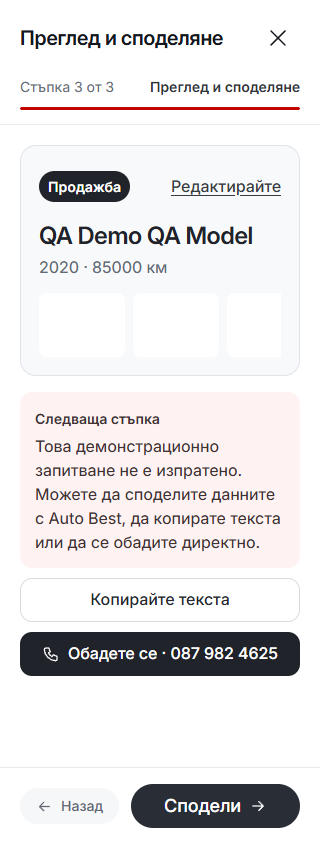
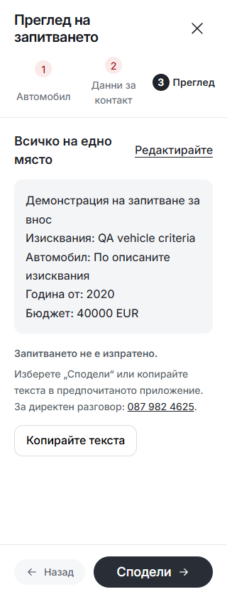

# Auto Best — final code audit, 8 October 2026

## Scope and source

Canonical source: `darkapoparka/cars`, `templates/auto-best`, on `main`. The application baseline is `1d144370f5bafaf8451120b9a6270f711a8a121a` (the source of the latest standalone phone-testing export at audit start). Later unrelated Cars commits were preserved. This audit changes the reusable master only; it does not promote `templates.lock.json`, export the standalone mirror, change hosting or refresh any dealer.

Coverage combines source-wide static checks and import/reachability analysis with targeted review of request handling, locale state, catalogue selection, formatting, entry-dialog lifetime, dependency resolution, build/preview ownership and the existing route/journey suites. It is not a claim that every line was manually rewritten or that browser emulation certifies physical devices.

## Implemented changes

| Area | Change and verification |
| --- | --- |
| Request/security boundary | Extracted `src/lib/server/security.ts` and made its handler outermost. Locale redirects, preference responses and rejected writes now receive the same security policy as ordinary pages. Tests cover immutable redirects, independent cookies, private caching, response bodies and bodyless 204/304 responses. Existing CSP directives are retained rather than silently tightened. |
| Entry-dialog lifetime | `EnquiryEntryField.svelte` and `ServiceEntryField.svelte` reuse `preserveScrollOffset`. Closing restores focus/scroll; destruction releases ownership without forcing the previous page's scroll position. Post-`tick` focus is guarded against a closed/detached dialog. Markup and compiled CSS remain identical. |
| Bounded catalogue cache | Replaced repeated canonical-make scans with a lookup map. Unknown URL-supplied makes return a shared frozen empty result and cannot grow the model-family cache. Regression coverage includes 2,000 arbitrary makes and mixed-case known makes. |
| Repeated formatting work | Listing numbers reuse the existing locale formatter cache. Plain translation labels bypass unnecessary interpolation/dealer-value allocation. Generated-message and numeric-output comparisons preserve results. These are helper-level improvements, not a measured page-load speed claim. |
| Dependency fixes | Lockfile updates: `brace-expansion` 5.0.9 → 5.0.12, `devalue` 5.9.2 → 5.9.4, `source-map-js` 1.2.1 → 1.2.2. A scoped override moves the vulnerable `cookie` 0.6.0 resolution to 0.7.2, with tests against the instance actually resolved by Kit. Svelte, Kit, Vite and the approved visual libraries were not migrated to new major versions. |
| Quality gates | Svelte diagnostics now fail on warnings, and TypeScript rejects unused locals/parameters. Added dependency auditing, security unit coverage and nine HTTP security-response cases. |
| Repeatable smoke execution | `scripts/smoke.mjs` runs the existing seven suites serially and fails fast. `smoke:preview` owns a fresh preview on an OS-assigned loopback port, checks readiness and closes it in `finally`. `quality` builds before starting that preview; it no longer depends on a manually running server whose output may have just been replaced. `smoke` still supports an explicit `BASE_URL`. |
| Current interaction tests | Updated legacy inline-form and flat-model assumptions to the actual service editors and grouped/searchable model controls. Kept validation, draft cancellation, focus, selection, URL and layout assertions. WebKit resize tests wait for native dialog closure, not merely CSS invisibility. Phase 4 waits for document/hydration/font readiness instead of third-party network inactivity, and reports each responsive boundary. |

## Removed clutter

Removed seven unreachable runtime/component files: `ServiceCallBanner.svelte`, `TeamSocialIcon.svelte`, `WorkflowShowcase.svelte`, `MobileBudget.svelte`, `hugeicons-mobile.ts`, `material-symbols-mobile.ts` and `PdpImportBanner.svelte`. Removed the unused vehicle-showcase helper and imports. The remaining reachability candidate is the ambient `src/locale.d.ts` declaration, which is intentionally retained. No production `console.log/debug/info`, debugger, TODO/FIXME or `@ts-ignore`/`@ts-nocheck` markers were found by the source scan.

Archived 46 obsolete one-off scripts, JSON QA dumps and screenshots from `docs/audits/pre-refactor-2026-09-12`: **1,851,613 bytes removed from the tracked checkout**. The original material remains available through immutable Git-history links and local recovery copies under ignored `runtime/final-audit-20261008/retired-evidence/`. Updated historical evidence links and added narrowly scoped ignore rules. This does not rewrite or shrink Git history.

Current test programs, approved media, all font/icon licenses and provenance were retained. Unrelated dirty instructions, historical notes and other sessions' untracked evidence were not mass-staged or deleted.

## Frontend preservation and visible copy

There are no changes to standalone CSS, design tokens, fonts, logos, SVG icon artwork, vehicle/media assets, route layouts or component markup. The three modified Svelte components pass direct source-markup and compiled-CSS comparisons against the saved baseline.

The visible change is limited to Bulgarian sharing copy: the Sell and Import review buttons use **“Сподели”** instead of **“Споделете запитването”** so the action fits at 320px. The Import review instruction quotes the same shortened label. English text and sharing behavior are unchanged.

The audit captured 28 route/locale/viewport comparisons across Home, Inventory, Detail, Sell, Import, About and Blog in BG/EN at 390/1440px. All retained page dimensions and the checks found no page errors, visible broken images or horizontal overflow. Eleven image files were byte-identical; the others were not. This is not a claim of universal pixel identity. The stronger preservation evidence for edited components is the unchanged markup and compiled CSS.

### Narrow-screen review actions

The following final-build screenshots contain synthetic test data, not submitted leads.

## Verification

| Verification | Actual result |
| --- | --- |
| Full `npm run quality` | Passed: source validation/build, zero registry vulnerabilities and all seven smoke suites. Fresh owned preview shut down successfully. |
| Final catalogue follow-up | Locale generation, full validation/build and all 27 locale unit tests passed after aligning the quoted Bulgarian label. |
| Svelte/TypeScript | Zero errors and zero warnings, with unused locals/parameters rejected. |
| Static contracts | Architecture 169 files; CSS policy 167 files; 225 tokens / 3,986 references; typography 1,113 declarations; assets 351 inventoried / 273 public references. All passed. |
| Domain/resource/security | Domain assertions passed; 12 resource/security unit tests passed; 26 scroll/viewport checks passed. |
| Final browser follow-up | Completion 12/12; all six Phase 4 groups including 11 responsive boundaries; HTTP security 9/9. All passed on the final build. |
| Broader saved locale checks | 180/180 page cases, 58/58 SSR cases, 76/76 legacy cases, HTTP 6/6, preferences 4/4, storage 6/6, races 8/8. Journey checks: 230 passed, 6 explicit skips, zero failures. |
| Cross-engine entry checks | 24 passed in Chromium and 24 passed in WebKit on the audited application logic. |
| Visual preservation | Three edited Svelte components have identical markup/compiled CSS. The 28 route captures retain dimensions; 11 PNGs are byte-identical. Final 320px review captures inspected. |
| Runner error handling | Unknown arguments and an unavailable explicit preview both fail before running browser suites. |

The original responsive timeout was rerun successfully unchanged at all 11 widths before the readiness improvement. An initial completion run then lost its externally managed preview during a rebuild and correctly failed on connection refusals. Those failures were not counted as passing. The fresh-preview runner removes that setup dependency.

The final quoted-label follow-up is a catalogue-only change after the full quality run. Locale generation, all 27 locale unit tests, full source validation/build and the focused completion/phase-4 checks were repeated on that final build. No application logic or styles changed after the successful full quality run.

Detailed logs, source backups, input hashes, pixel comparisons and recovery manifests are retained under ignored `runtime/final-audit-20261008/`; only this report and the two relevant screenshots are added as new permanent audit evidence.

## Deliberate boundaries

Physical iOS/Android keyboard and safe-area testing, mounted/dealer/public-host acceptance and actual enquiry delivery are separate release checks. Forms remain honest local/demo sharing flows; no backend delivery is represented as complete. The dependency audit is a registry-advisory check, not a security certification. No large-component rewrite, speculative state framework, asset replacement or hosting migration was introduced just to increase the diff.

Relevant framework references: [SvelteKit hooks](https://svelte.dev/docs/kit/hooks), [SvelteKit state management](https://svelte.dev/docs/kit/state-management), [Vite preview API](https://vite.dev/guide/api-javascript#preview), and [Playwright page readiness](https://playwright.dev/docs/api/class-page#page-goto). Existing installed Svelte 5/Kit 2 APIs and tests remain authoritative for this source.
