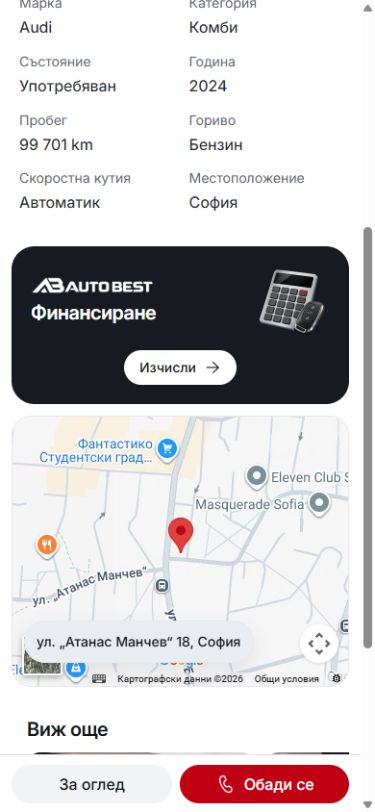
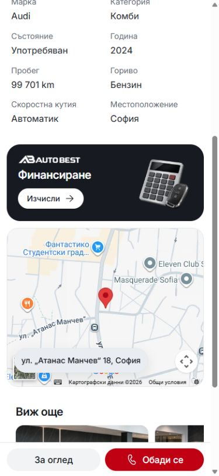

# Auto Best mobile finalization — 8 October 2026

The accepted mobile version groups the finance logo, heading and compact Calculate action on the left, with the calculator/key illustration beside them. Vehicle detail uses one white content surface. Mobile inputs and search editors retain the shared viewport attachment, accessible scroll containers, rounded fields and Fluent Regular actions/checkmarks.

Matched finance screenshots at 390×844 and scrollY 422:

| Before the final alignment | Accepted alignment |
| --- | --- |
|  |  |

The final card is 136px high at 390px and 131.046875px at 320px. Logo, title and button share the same left edge. The finance button retains a 44px touch target, 36px painted surface and 14px label, below the existing Call/Viewing action's 40px painted surface and 16px label.

Local browser verification covered Bulgarian and English at 320/390px, loaded imagery, one-line finance controls, horizontal overflow, and calculator open/close with focus restoration. The mobile banner stays hidden at 1440px. No browser console warnings/errors appeared in this pass. These are viewport checks; they do not claim hardware-phone or OS-keyboard testing.

Before saving this source, Node 22.20.0 completed npm run validate and npm run test:locales (27 passed). Svelte/type checking reported zero errors and zero warnings. Earlier overlay verification is recorded in MOBILE-SEARCH-OVERLAYS-2026-10-08.md and MOBILE-SERVICE-EDITOR-ACTIONS-2026-10-08.md; their original validation dates and limits remain historical evidence.

The editable master is templates/auto-best in darkapoparka/cars. The standalone darkapoparka/cars-template-auto-best repository is its publishing mirror. Live Vercel metadata confirmed that the existing cars-template-auto-best project deploys from that mirror's main branch. GitHub source saving, a mirror push, hosted deployment, release-lock selection and dealer updates are separate operations; this source change does not select a new release lock or refresh dealers.
