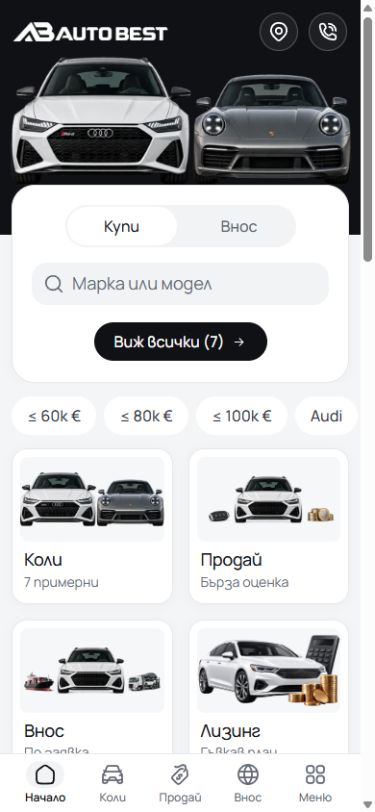
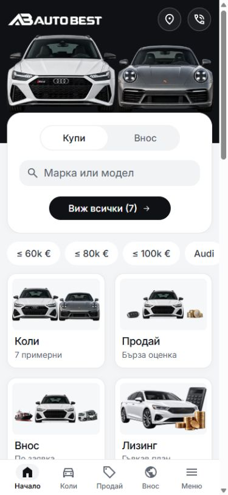
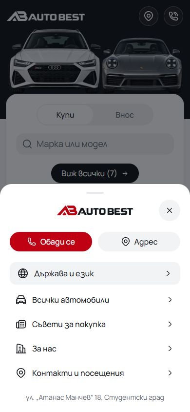
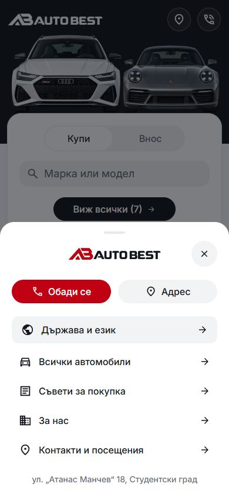
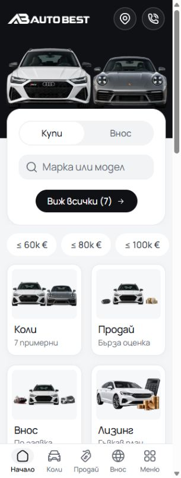
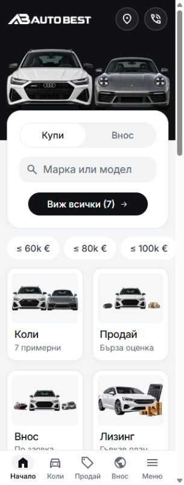
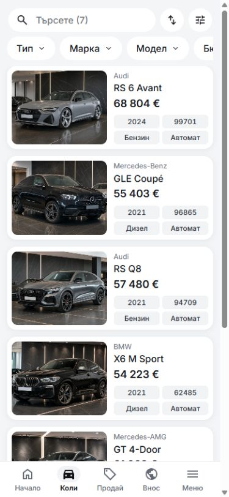
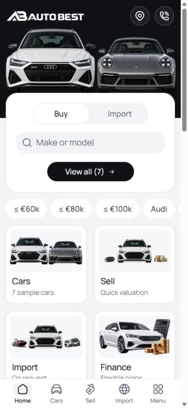
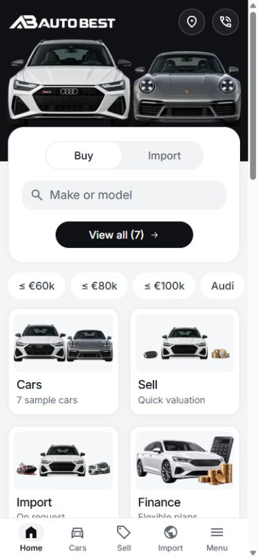
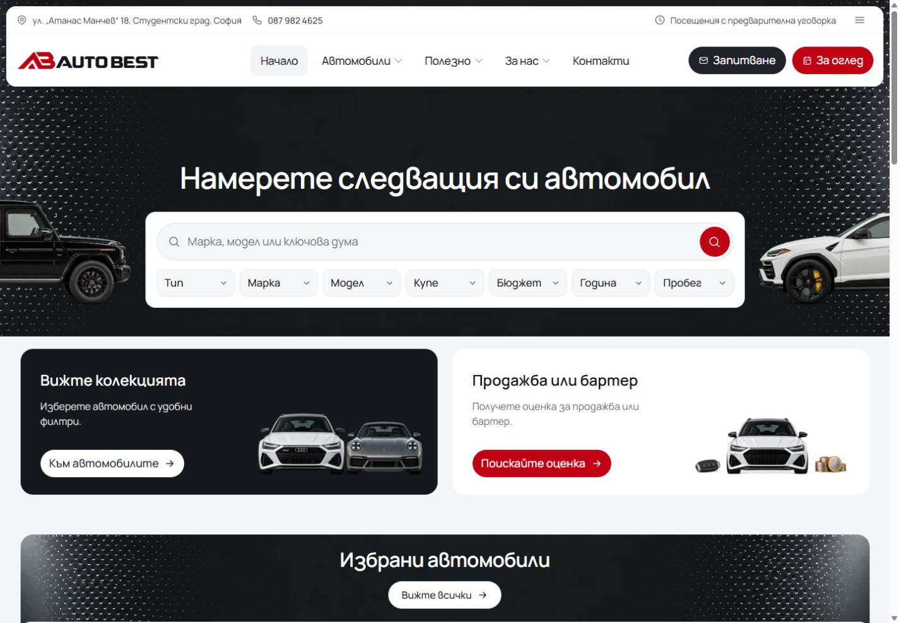

# Auto Best icon and typography comparison

The owner rejected Phosphor and authorized a replacement icon system and Inter. The implementation uses locally bundled Inter v4.1 and official Material Symbols Sharp SVGs, with outlined inactive actions and filled active dock destinations. Font body/entry roles use 450, controls 500 and headings/prices 600. The Bulgarian inventory action was widened through its shared token to keep its label on one line.

These are real browser captures from the existing Auto Best development server at `http://127.0.0.1:6461`, taken before and after the implementation with matched routes, scroll positions and viewports. The before state is the retained working preview with Manrope and Hugeicons; it includes previously pending template work. Mobile captures are 844px high, and desktop captures are 1000px high. Layout, artwork and dealer identity in each pair are preserved.

| View | Before: Manrope / Hugeicons | After: Inter / Material Symbols Sharp |
| --- | --- | --- |
| Bulgarian Home, 390px |  |  |
| Bulgarian menu, 390px |  |  |
| Bulgarian Home, 320px |  |  |
| Bulgarian inventory, 390px |  |  |
| English Home, 390px |  |  |
| Bulgarian desktop, 1440px |  |  |

## Verification

All checks below ran locally with Node 22.20.0. Browser checks used the production Vite preview at port 6498.

- `npm run validate`: architecture, CSS policy, tokens, typography and visual pins, assets, domain data, Svelte, locale/source checks and production build passed.
- Focused `desktop-routes-smoke.mjs`: 30 passing BG/EN cases across Home, inventory, About, Blog and Contact at 320, 390 and 1440px. The desktop font check inspects the actual browser platform font, confirming bundled Inter.
- `mobile-final-smoke.mjs`: six passing BG/EN cases at 320, 390 and 430px, including 200% text reflow, artwork separation, menu Escape/focus restoration, hidden dock state and reduced motion.
- `mobile-polish-smoke.mjs`: eight passing BG/EN cases at 320, 390, 430 and 1440px, including dock active states, menu, filters, vehicle/service actions and advice search.

The checkout also contains unrelated pending template work. The implementation commit includes only font/icon changes, their responsive compatibility checks and these comparisons; it does not promote a template release or prove an otherwise clean release build.

The pinned font contains the Bulgarian alphabet, including Ѝ/ѝ, but has no dedicated Bulgarian localized alternates. Real BG/EN document language is retained. [Inter provenance](../../provenance/inter.md) and [Material Symbols provenance](../../provenance/material-symbols.md) record exact source versions, delivered hashes and licenses. `check-visual-system.mjs`, invoked by typography validation, checks those pins and the unmodified official SVG paths.

The visual judgment favors the firmer text and simpler destination symbols shown here. Local QA confirms rendering and interaction; owner visual acceptance and any template release or dealer deployment remain separate.
