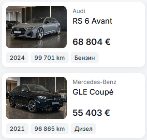

# Fourth mobile inventory fact — 10 October 2026

Following the three-fact narrow-card revision, a fourth transmission badge fits at 320px without truncation or reduced badge padding. The current narrow-card set is year, full mileage, fuel and transmission. Body style remains visible on wider mobile cards; Home retains its three facts.

The component removes only transmission from the narrow-container hide rule. It retains the 8px badge padding, 4px gaps, 18px inventory price, enlarged-text stacking, radii and desktop rules. Existing compact transmission labels remain `Автомат` / `Auto` with their full accessible values.

The existing preview passed focused checks in BG/EN: all seven actual cards at 320px have four untruncated facts on one row; 390px keeps four and 430px shows five. Six-digit mileage plus electric fuel still fit at 320px. Enlarged text wraps the four facts without clipping or horizontal overflow. `result.json` records the compact results. The retained smoke assertions now expect four facts on narrow listing cards.

| 320px before: three facts | 320px after: four facts |
| --- | --- |
|  |  |

These two matched captures are the final comparison. No production build or wider route campaign was repeated for this one-rule adjustment. The Svelte autofixer retains its existing localized-link wrapper advisory; the component compiles and the affected preview renders without page errors.
