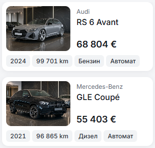
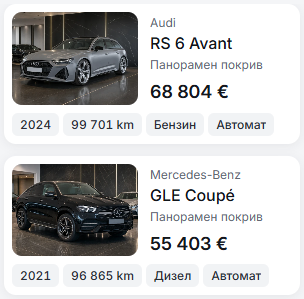

# Mobile inventory note — 10 October 2026

A single muted 12px/450 line now sits between the model and its 18px price on mobile inventory cards. It uses the existing metadata font/color tokens. The photo and content can grow enough to preserve an 8px note-to-price gap. Home, desktop, the four narrow-card facts and all corner roles retain their preceding treatment.

`Vehicle.cardNote` accepts seller-supplied copy by locale, such as `{ bg: 'Нов внос', en: 'New import' }`. Import and condition claims require supplied record-specific information. The current master records have no such notes, so the visible default uses their listed panoramic-roof feature (or first equipment item when that feature is absent). Missing notes/equipment leave the line absent. Long supplied notes retain their full text/title while truncating visually in the side column; the enlarged-text stacked layout allows wrapping.

Focused preview checks passed for all seven cards in BG/EN at 320/390px, including 320px with 200% text. Existing long Tesla/electric/LPG fixtures keep the note readable. All measured desktop card geometry/type at 1440px matches its baseline. Svelte/type checks report zero errors/warnings and locale source audit reports no issues; the autofixer retains its existing localized-link wrapper advisory. No production build was repeated.

| 320px before | 320px after |
| --- | --- |
|  |  |

`result.json` retains compact results and one measured before/after sample. The two final captures remain; intermediate raw measurements were retired. Source delivery does not promote a template release or deploy dealers.
