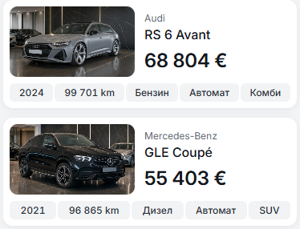
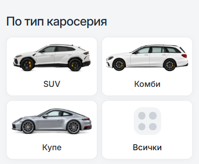
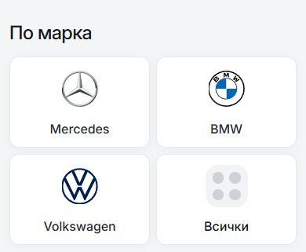

# Applied 12px mobile card default

The owner selected **12px** for mobile outer cards after reviewing the matched
16px/12px screenshots. `--dn-radius-mobile-card` now has a saved 12px value.
All mobile outer-card families follow it below 768px. Existing desktop card
sizes are preserved.

Mobile vehicle fact badges remain **6px**, and inset listing photos remain
**10px**. At normal type size the fact badges are 23px tall; a 12px radius would
produce pill ends. Shared rounding uses roles suited to the element's size,
rather than giving badges and containers identical corner numbers.

## Actual desktop measurements

These are computed styles from the production build at 1440px, with the saved
12px mobile default active.

| Element | Desktop | Mobile |
| --- | --- | --- |
| Home vehicle cards | 16px | 12px |
| Inventory vehicle cards | 20px | 12px |
| Brand and body-type tiles | 16px | 12px |
| Blog/editorial cards | 16px | 12px |
| Large Home trust/service banners | 20px | 12px |
| Vehicle photo badges | Pill token, 999px | Hidden; fact badges use 6px |

The Home desktop search form also retains its pill shape. The general desktop
radius token remains 16px; entry/content and other panel roles keep their
existing values. [Full measurements](radius-inventory.json) record visible
cards, badges and photo corners at each viewport.

## Matched 390px screenshots

The 16px baseline uses a temporary mobile-token override on the same build.
The after screenshots use the saved 12px source default with that override
removed. Content, viewport, fonts and layout match within each pair.

| Surface | Before: 16px | Applied: 12px |
| --- | --- | --- |
| Cars |  |  |
| Body types |  |  |
| Brands |  |  |
| All services |  |  |

## Other comparisons

Each pair is before 16px / applied 12px.

| Surface | 390px | 320px |
| --- | --- | --- |
| Cars | [Before](before-16-cars-390.png) / [After](after-12-cars-390.png) | [Before](before-16-cars-320.png) / [After](after-12-cars-320.png) |
| Body types | [Before](before-16-body-types-390.png) / [After](after-12-body-types-390.png) | [Before](before-16-body-types-320.png) / [After](after-12-body-types-320.png) |
| Brands | [Before](before-16-brands-390.png) / [After](after-12-brands-390.png) | [Before](before-16-brands-320.png) / [After](after-12-brands-320.png) |
| All services | [Before](before-16-services-390.png) / [After](after-12-services-390.png) | [Before](before-16-services-320.png) / [After](after-12-services-320.png) |
| Home entry | [Before](before-16-home-entry-390.png) / [After](after-12-home-entry-390.png) | [Before](before-16-home-entry-320.png) / [After](after-12-home-entry-320.png) |
| Featured cars | [Before](before-16-featured-390.png) / [After](after-12-featured-390.png) | [Before](before-16-featured-320.png) / [After](after-12-featured-320.png) |
| Showroom | [Before](before-16-showroom-390.png) / [After](after-12-showroom-390.png) | [Before](before-16-showroom-320.png) / [After](after-12-showroom-320.png) |
| Blog | [Before](before-16-blog-390.png) / [After](after-12-blog-390.png) | [Before](before-16-blog-320.png) / [After](after-12-blog-320.png) |
| Sell | [Before](before-16-sell-390.png) / [After](after-12-sell-390.png) | [Before](before-16-sell-320.png) / [After](after-12-sell-320.png) |
| Import | [Before](before-16-import-390.png) / [After](after-12-import-390.png) | [Before](before-16-import-320.png) / [After](after-12-import-320.png) |

## Verification and source scope

- Changed the mobile card token in `src/lib/styles/tokens.css` and its expected
  defaults in `scripts/check-tokens.mjs` and `scripts/radius-smoke.mjs`.
  Updated the styling/testing references and linked the prior comparison.
- Node 22.20.0; token and CSS policy checks passed across 172 runtime files.
- Svelte compiler/type check: 0 errors and 0 warnings. Production build passed.
- [Saved 12px default](radius-12.json): 66 mobile cases passed across 11 route
  states, BG/EN and 320/390/767px. Vehicle fact/photo corner checks passed.
- [Matched comparison](comparison.json): 40 route/width cases passed at
  320/390/768/1440px. Visible geometry, typography, padding, borders and colors
  were unchanged; visible corners were unchanged in all 20 tablet/desktop cases.
- [Completion](verification.json): both workers passed and the owned preview
  was closed. The existing development server was preserved.

This is a local template change. No commit, template promotion or deployment
was made. The [prior comparison](../mobile-card-radius-comparison-2026-10-09/README.md)
and [full-project inspection](../full-project-standardization-2026-10-09/README.md)
remain available as earlier evidence.

A supplementary read of the existing shared development server reached the
mobile inventory and desktop Home/inventory pages but timed out on Contact.
The screenshot and route evidence above therefore uses the fresh production
preview; it does not establish the health of every route on that shared server.
