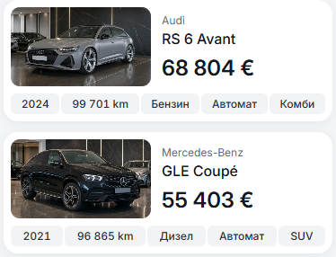
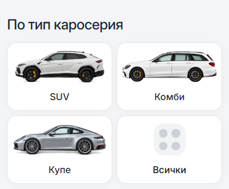
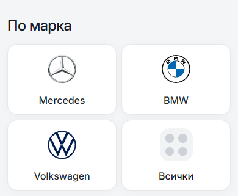
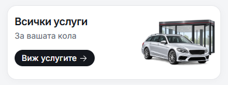
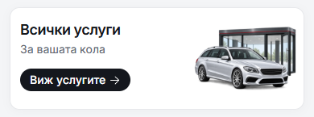

# Mobile cards: 16px versus 12px

This comparison recorded the prior **16px** default. The owner subsequently selected [12px as the saved mobile default](../mobile-card-radius-12-2026-10-09/README.md). The **12px** images are a rendered preview
controlled by `--dn-radius-mobile-card`; they do not change the saved default.
Both versions use the same content, viewport, fonts and layout. The measurements below describe the comparison before that selection.

All mobile outer-card families now follow that token: vehicle cards, brand/body
tiles, entry forms, editorial cards, service cards, showroom panels, contact
cards, preferences and vehicle-detail cards. Generic outer cards use
`--dn-radius-card`; the mobile shell maps it and the existing family roles to
`--dn-radius-mobile-card` below 768px. The role wiring preserves the current 16px
appearance and the existing desktop sizes.

| Element | Current | Preview |
| --- | --- | --- |
| Mobile outer cards | 16px | 12px |
| Mobile vehicle fact badges | 6px | 6px |
| Inset mobile car photos | 10px | 10px |
| Drawer top corners | 24px | 24px |
| Desktop card corners | Existing per-family sizes | Unchanged |

Bordered editorial media follow the outer card with a one-pixel inset. Controls,
header and dock shapes retain their own roles. To adopt 12px, change the mobile
card token and update the expected default in its validation; component corners
do not need individual edits.

## Matched 390px screenshots

| Surface | Before: 16px | Preview: 12px |
| --- | --- | --- |
| Car cards |  |  |
| Body types |  |  |
| Brands |  |  |
| All services |  |  |

## Other comparisons

Each pair is before 16px / preview 12px.

| Surface | 390px | 320px |
| --- | --- | --- |
| Car cards | [Before](before-16-cars-390.png) / [Preview](after-12-cars-390.png) | [Before](before-16-cars-320.png) / [Preview](after-12-cars-320.png) |
| Body types | [Before](before-16-body-types-390.png) / [Preview](after-12-body-types-390.png) | [Before](before-16-body-types-320.png) / [Preview](after-12-body-types-320.png) |
| Brands | [Before](before-16-brands-390.png) / [Preview](after-12-brands-390.png) | [Before](before-16-brands-320.png) / [Preview](after-12-brands-320.png) |
| All services | [Before](before-16-services-390.png) / [Preview](after-12-services-390.png) | [Before](before-16-services-320.png) / [Preview](after-12-services-320.png) |
| Home entry | [Before](before-16-home-entry-390.png) / [Preview](after-12-home-entry-390.png) | [Before](before-16-home-entry-320.png) / [Preview](after-12-home-entry-320.png) |
| Featured cars | [Before](before-16-featured-390.png) / [Preview](after-12-featured-390.png) | [Before](before-16-featured-320.png) / [Preview](after-12-featured-320.png) |
| Showroom | [Before](before-16-showroom-390.png) / [Preview](after-12-showroom-390.png) | [Before](before-16-showroom-320.png) / [Preview](after-12-showroom-320.png) |
| Blog | [Before](before-16-blog-390.png) / [Preview](after-12-blog-390.png) | [Before](before-16-blog-320.png) / [Preview](after-12-blog-320.png) |
| Sell service | [Before](before-16-sell-390.png) / [Preview](after-12-sell-390.png) | [Before](before-16-sell-320.png) / [Preview](after-12-sell-320.png) |
| Import service | [Before](before-16-import-390.png) / [Preview](after-12-import-390.png) | [Before](before-16-import-320.png) / [Preview](after-12-import-320.png) |

## Verification

Node 22.20.0, a fresh production build and a task-owned production preview.
The preview was closed after verification. No publication or commit was made.

- Svelte compiler/type check: 0 errors, 0 warnings. Production build passed.
- [16px default](radius-16.json): 66 mobile cases passed.
- [12px preview](radius-12.json): 66 mobile cases passed.
- Both radius runs cover 11 route states, BG/EN, and widths 320/390/767px,
  including actual badge/photo corners on vehicle cards.
- [Matched comparison](comparison.json): 40 route/width cases passed across
  Home, Cars, About, Blog, Article, Contact, Sell, Import, Vehicle and Preferences.
  Visible element geometry, typography, padding, borders and colors were
  unchanged at 320/390/768/1440px. All visible corners were unchanged in the
  20 tablet/desktop cases at 768/1440px.
- [Run completion](verification.json): all three workers passed; preview closed.

The [full-project inspection](../full-project-standardization-2026-10-09/README.md)
records the earlier source and interaction audit. This comparison adds the
single mobile card control and tests the 12px candidate without changing its
current default.
