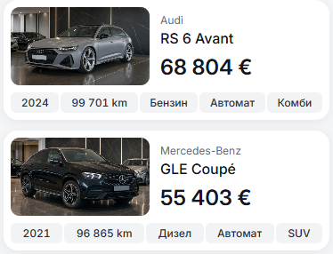
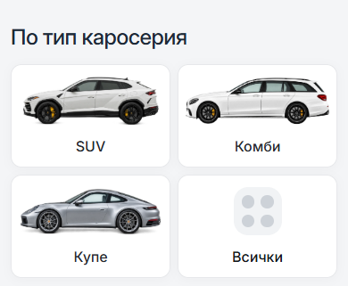
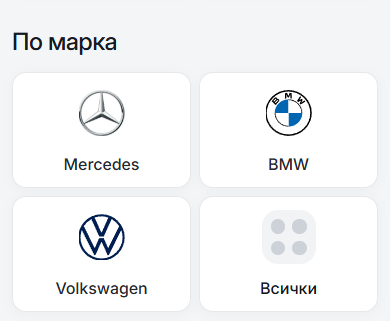
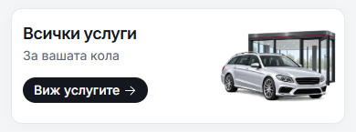
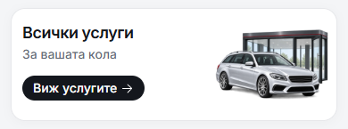

# Mobile card corners: 12px, 14px and 16px

[Open the comparison viewer](index.html) to switch between all three sizes in
the same position, or view them side by side. It includes ten card surfaces at
390px and 320px mobile widths.

The saved mobile default remains **12px**. This experiment changes only
`--dn-radius-mobile-card` in the browser for the 14px and 16px candidates.
Badges remain 6px, inset listing photos 10px and desktop geometry is preserved.

All three values are valid design choices. In this UI, 12px gives a sharper
outline, 14px is the middle option, and 16px gives softer corners. The difference
between neighboring options is only 2px. Shared tokens provide consistency;
they do not make one value universally correct.

## Matched 390px renders

| Surface | 12px | 14px | 16px |
| --- | --- | --- | --- |
| Cars |  |  |  |
| Body types |  |  |  |
| Brands |  |  |  |
| All services |  |  |  |

## Full gallery

| Surface | 390px: 12 / 14 / 16 | 320px: 12 / 14 / 16 |
| --- | --- | --- |
| Cars | [12](radius-12-cars-390.png) / [14](radius-14-cars-390.png) / [16](radius-16-cars-390.png) | [12](radius-12-cars-320.png) / [14](radius-14-cars-320.png) / [16](radius-16-cars-320.png) |
| Body types | [12](radius-12-body-types-390.png) / [14](radius-14-body-types-390.png) / [16](radius-16-body-types-390.png) | [12](radius-12-body-types-320.png) / [14](radius-14-body-types-320.png) / [16](radius-16-body-types-320.png) |
| Brands | [12](radius-12-brands-390.png) / [14](radius-14-brands-390.png) / [16](radius-16-brands-390.png) | [12](radius-12-brands-320.png) / [14](radius-14-brands-320.png) / [16](radius-16-brands-320.png) |
| Services | [12](radius-12-services-390.png) / [14](radius-14-services-390.png) / [16](radius-16-services-390.png) | [12](radius-12-services-320.png) / [14](radius-14-services-320.png) / [16](radius-16-services-320.png) |
| Home entry | [12](radius-12-home-entry-390.png) / [14](radius-14-home-entry-390.png) / [16](radius-16-home-entry-390.png) | [12](radius-12-home-entry-320.png) / [14](radius-14-home-entry-320.png) / [16](radius-16-home-entry-320.png) |
| Featured cars | [12](radius-12-featured-390.png) / [14](radius-14-featured-390.png) / [16](radius-16-featured-390.png) | [12](radius-12-featured-320.png) / [14](radius-14-featured-320.png) / [16](radius-16-featured-320.png) |
| Showroom | [12](radius-12-showroom-390.png) / [14](radius-14-showroom-390.png) / [16](radius-16-showroom-390.png) | [12](radius-12-showroom-320.png) / [14](radius-14-showroom-320.png) / [16](radius-16-showroom-320.png) |
| Blog | [12](radius-12-blog-390.png) / [14](radius-14-blog-390.png) / [16](radius-16-blog-390.png) | [12](radius-12-blog-320.png) / [14](radius-14-blog-320.png) / [16](radius-16-blog-320.png) |
| Sell | [12](radius-12-sell-390.png) / [14](radius-14-sell-390.png) / [16](radius-16-sell-390.png) | [12](radius-12-sell-320.png) / [14](radius-14-sell-320.png) / [16](radius-16-sell-320.png) |
| Import | [12](radius-12-import-390.png) / [14](radius-14-import-390.png) / [16](radius-16-import-390.png) | [12](radius-12-import-320.png) / [14](radius-14-import-320.png) / [16](radius-16-import-320.png) |

## Verification

The rendered experiment reused the verified production build of the saved 12px
default. No application source or build output changed during this comparison.

- [14px card-role checks](radius-14.json): 66 passed across 11 route states in
  BG/EN at 320/390/767px. Fact badges, listing-photo corners, control corners,
  sheet corners and mobile gutter checks passed.
- [Three-way comparison](comparison.json): 120 route/width/radius states across
  10 routes, 320/390/768/1440px and three radius values. Geometry, typography,
  padding, border widths and colors match the 12px baseline. Both alternatives
  preserve all visible tablet/desktop corners on each of the 20 route/width
  states at 768/1440px. No browser exceptions were recorded.
- [Run completion](verification.json): both workers passed; the production
  preview was closed. A separate read-only local viewer serves these images.
- [Viewer check](viewer-check.json): radius switching, both display modes and
  all 60 screenshots loaded successfully, with no browser exceptions.
- The existing [12px default verification](../mobile-card-radius-12-2026-10-09/README.md)
  and [16px baseline verification](../mobile-card-radius-comparison-2026-10-09/README.md)
  remain available. This experiment adds the 14px candidate and matched three-way
  images without changing the saved choice.

The only shared-code change for this experiment is adding 14 to the supported
preview values in `scripts/radius-smoke.mjs`, with the testing reference updated.
There was no commit, promotion or deployment.
