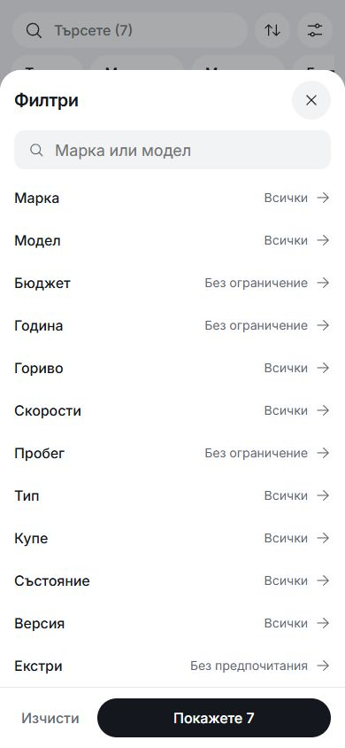
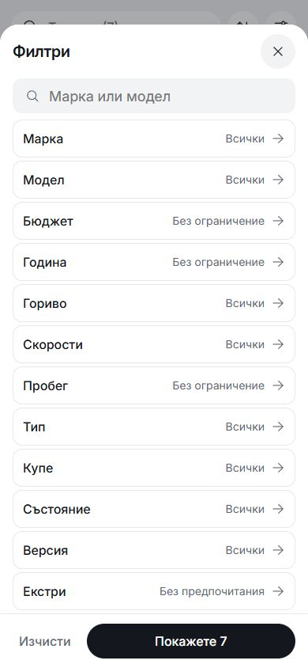
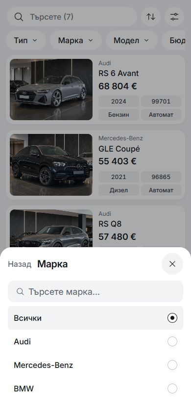
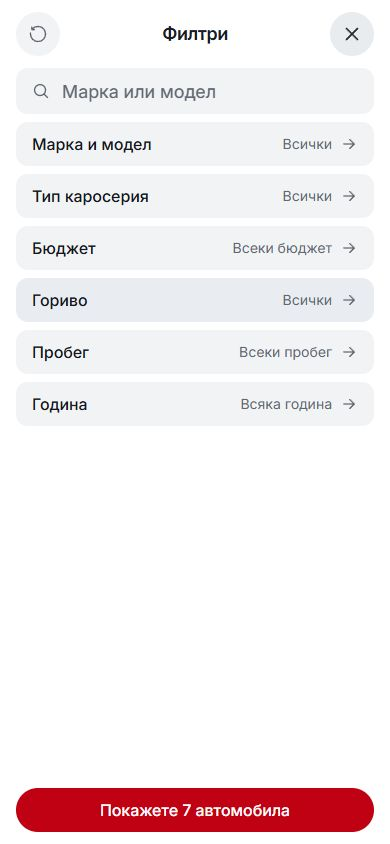

# Final mobile filter pass — 6 October 2026

This outlined treatment was rejected after comparison with the earlier grey
controls. See [the current soft-grey controls](../mobile-filter-soft-2026-10-06/README.md).
The captures and checks below preserve the experiment as history.

Local preview: [inventory](http://127.0.0.1:6461/bg/listing-grid) and
[Home](http://127.0.0.1:6461/bg). This pass restores visible button boundaries
without filling every control gray or turning selected choices solid black.

## Interaction and appearance

- Overview and choice controls have white surfaces, light outlines, 12px corners,
  48px minimum targets and 4px gaps. Selected controls use a pale surface and
  stronger border. Touch presses give visible feedback.
- Each sheet has one black primary action. Header actions, search and footer
  actions keep their 44px roles. Long text can grow vertically.
- Inventory exposes all twelve criteria. Each quick pill opens its own editor;
  Search focuses the keyword input. A single native dialog owns the full filter
  overview and its editors. Single choices return immediately. Ranges and extras
  use Save; Back discards the unfinished editor and Close discards the full draft.
- Budget, year and mileage presets edit the draft alongside exact numeric inputs.
  Their values come from the existing stock/catalog. Range errors appear directly
  under the inputs. Wrapped presets fit the sheet when screen space permits.
- Home keeps its six criteria, make-to-model flow and two-column choices. Its
  sheet fits the content instead of reserving an empty full-screen panel.
- Repeated Escape returns to the overview before closing, and restores focus to
  the relevant control. Long model titles clear Back and Close at enlarged text.
- Applied quick pills use an outline and removal glyph. Typography and mobile
  actions retain the pinned Inter v4.1 and Fluent Regular assets.

## Matched captures

Before means the UI at the start of this pass. Both comparison columns use
390×844px, BG, the same route and unchanged sample inventory.

| Surface | Before | After |
| --- | --- | --- |
| Inventory overview |  |  |
| Brand editor |  |  |
| Home overview |  |  |

Additional captures: [budget](after-budget-390.png),
[Home brand choices](after-home-make-390.png),
[selected criterion](after-selected-390.png) and
[320px overview](after-overview-320.png).

## Source owners

| Area | Files |
| --- | --- |
| Shared control roles | `src/lib/styles/tokens.css`, `src/lib/styles/base.css` |
| Full inventory sheet and reusable editors | `src/lib/components/listing/MobileListingFilters.svelte`, `ListingFacetEditor.svelte` |
| Opening height measurement | `src/lib/ui/overlay-content.ts`, `src/lib/components/listing/QuickFilterSheet.svelte` |
| Toolbar, direct search focus and quick pills | `src/lib/components/listing/ListingFilters.svelte`, `VehicleSearchDialog.svelte` |
| Home controls and focus | `src/lib/components/home/VehicleQuickSearch.svelte` |
| Focused regression coverage | `scripts/mobile-filter-smoke.mjs`, `mobile-reflow-smoke.mjs`, `overlay-proportions-smoke.mjs` |

The opening-height helper measures rendered child bounds, then fits the final
available width. Filtering search results retains that opening space; it does not
move the header or footer on each keystroke. Control surfaces, dimensions and
selected states share tokens instead of duplicating component-specific values.

## Local verification

Node 22.20.0, existing Vite preview at port 6461, `main`, base HEAD
`08c89d63f9e11939acd5b135ece4278252b80f43` plus uncommitted working changes.

| Check | Result |
| --- | --- |
| Svelte check and production build, including locale audits | Passed; 0 Svelte errors/warnings |
| Architecture, CSS, tokens, typography and visual pins | Passed; 158 application/configuration files, 156 CSS-policy files, 216 tokens, 1158 typography declarations |
| Full Home/inventory journeys | 4 passed: 320×677, 390×844, 430×932, 700×390 |
| Focused reflow, BG/EN | 48 passed in Chromium and 48 in WebKit: normal, 200% root text, text spacing and short viewports |
| Recheck after opening-height refinement | 30 passed in Chromium; 29 in WebKit plus the remaining case on an isolated repeat |
| Control proportions, BG/EN | 18 passed |
| Filter overlay controls/focus, BG/EN | 10 passed |
| Desktop discovery/focus baseline | 6 passed at 1024/1440/1920px |
| Domain and scroll/viewport checks | Passed |

The WebKit recheck initially timed out opening the EN 390px budget pane before
the reflow assertions. Its isolated repeat passed. The failed report and repeat
log are retained under `runtime/mobile-filter-final-2026-10-06/`, alongside the
other local logs and source preimages.

Desktop composition and unrelated working changes are preserved. This is local,
uncommitted template work; no template promotion or dealer publication occurred.
Browser mobile emulation does not verify a physical Android/iPhone keyboard or
device safe areas.
