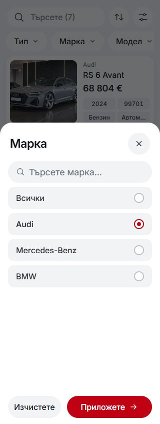
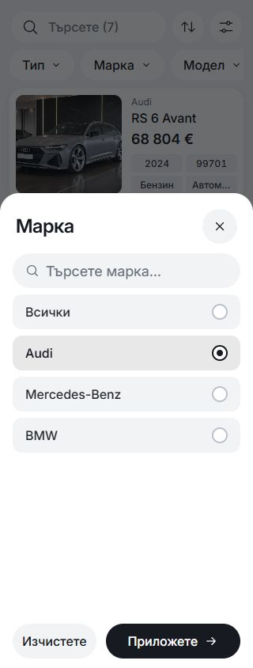
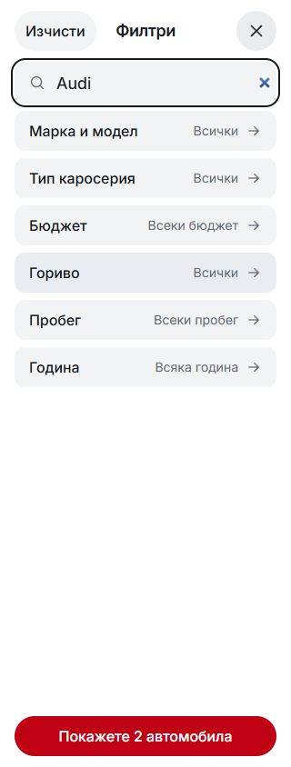
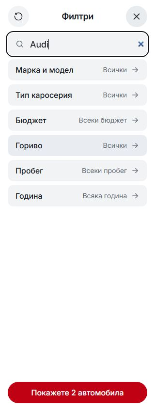

# Mobile filter selection polish — 4 October 2026

Mobile quick-filter choices use a charcoal checked ring/dot and a subtly darker grey selected row. Apply uses the same charcoal as the mobile action palette. The live radio geometry approved by the owner remains 20px with a 2px border and an 8px dot; option rows remain 44px high. Colours come from shared tokens and apply below 768px. Desktop styles retain their existing palette.

| Before — BG 320 × 844 | After — BG 320 × 844 |
| --- | --- |
|  |  |

Source changes are limited to `src/lib/components/listing/QuickFilterSheet.svelte` and `src/lib/styles/tokens.css`. The existing uncommitted radio-circle correction in the same mobile block was preserved and reviewed with this polish. Native checkboxes and the forced-colours fallback remain in place.

Validation: Svelte check reported zero errors/warnings; CSS policy, token, typography, pinned Inter/Fluent, locale checks and the production build passed on Node 22.20.0. Native browser checks covered BG selection geometry at 320/390px, English Apply/Clear at 320px, keyboard radio selection and native checkbox selection at 390px, and preserved desktop styling at 1440px. No horizontal overflow was observed. The final screenshot tab reported no console errors.

`verification.json` contains measured geometry and behaviour results. The shared checkout contains unrelated work; it was excluded from this commit. No dealer deployment or template release selection was performed.

## Completed comparison for the earlier reset-icon change

The Home filter header's `Изчисти` text was replaced by the pinned official Fluent counterclockwise arrow in source commit `0e51167ab632f877a97693498572fd2ce287ead0`. These matched captures complete its earlier pending browser comparison. The before image uses the preserved compiled baseline; the after image uses the canonical dev server. The 44px touch target, localized accessible label/title, disabled state and Clear behaviour were verified.

| Before — BG 320 × 844 | After — BG 320 × 844 |
| --- | --- |
|  |  |
