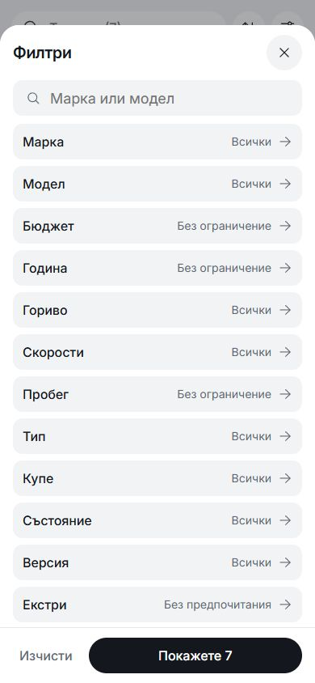
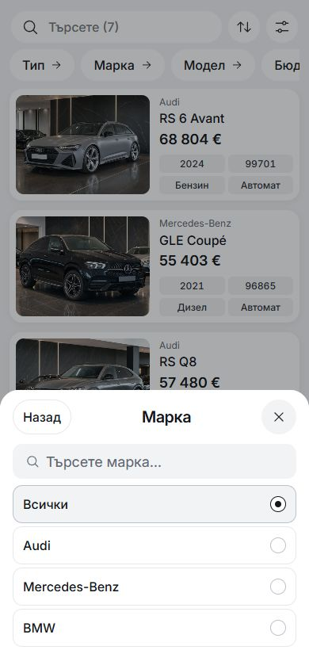
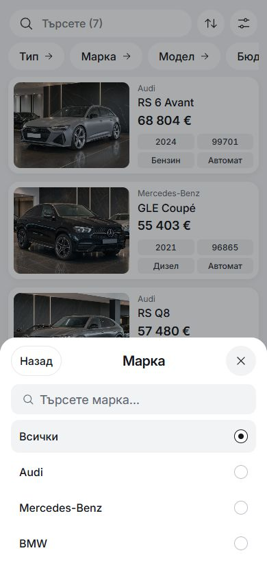
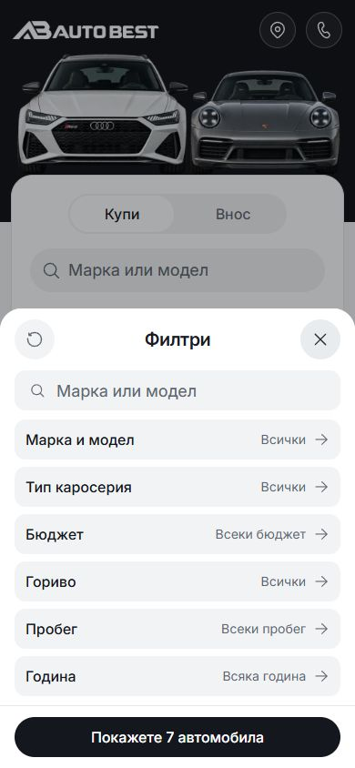

# Restored mobile filter controls — 6 October 2026

Preview: [inventory](http://127.0.0.1:6461/bg/listing-grid) and
[Home](http://127.0.0.1:6461/bg).

The outlined stack was visually busier than the earlier grey buttons. This pass
restores the useful button surfaces and spacing while keeping the improved
editor behavior, focus restoration, direct quick pickers and content-sized sheets.

## Current treatment

- Overview buttons and Home's two-column choice buttons use the existing soft
  grey surface, 12px corners and no decorative border.
- Their full tap target is 48px. The paint is inset 2px at the top and bottom,
  making a 44px visible surface and 8px of visible space between rows. The Home
  choice columns also have 8px between them.
- Native inventory choice lists use white rows with small radio/checkbox
  indicators. Only the selected row gets a pale fill. Each option retains its
  48px minimum target and visible keyboard focus.
- The primary action stays black. Range inputs, presets, Back/Save, draft
  cancellation, dependent model reset and existing GET parameters are preserved.

The source delta is limited to mobile rules in `src/lib/styles/base.css`, the
shared control surface/inset tokens in `src/lib/styles/tokens.css`, and the mobile
choice-column gap in `src/lib/components/home/VehicleQuickSearch.svelte`.
Desktop styling and behavior are unchanged by this pass.

## Matched 390×844 BG captures

| Surface | Rejected outlines | Restored controls |
| --- | --- | --- |
| Inventory overview |  |  |
| Brand choices |  |  |
| Home overview |  |  |
| Home choices |  |  |

Also see the [320px overview](after-overview-320.png). The earlier light-grey
reference is retained in [the App comparison](../filter-reference-2026-10-06/README.md).

## Local checks and boundary

Node 22.20.0, existing Vite preview at port 6461, `main`, base HEAD
`08c89d63f9e11939acd5b135ece4278252b80f43` plus the preserved working changes.
Logs and source preimages are in `runtime/mobile-filter-soft-2026-10-06/`.

Svelte check reports 0 errors/warnings; the production build and locale audits
pass. Architecture, CSS policy, tokens, typography and the Inter/Fluent visual
pins pass.

| Browser check | Result |
| --- | --- |
| Full Home/inventory journeys, direct quick pickers, ranges, drafts and URL | 4 passed: 320×677, 390×844, 430×932 and 700×390 |
| Control proportions in BG/EN | 18 passed at 320/390/430px |
| Home overview/make/model and inventory overview reflow | 24 passed in Chromium and 24 in WebKit, in BG/EN at 320/390/430px |

Reflow checks include normal layout, 200% root text, text-spacing overrides and
420px-tall viewports. The live overview was also inspected at 320×677 and 390×844.
Its computed border is 0px, tap height is 48px and paint inset is 2px vertically.
No new test implementations were added for this styling correction.

This is local, uncommitted template work. No release promotion or dealer
publication occurred. Mobile evidence is browser emulation; physical phone
keyboards and safe areas remain outside these checks.
