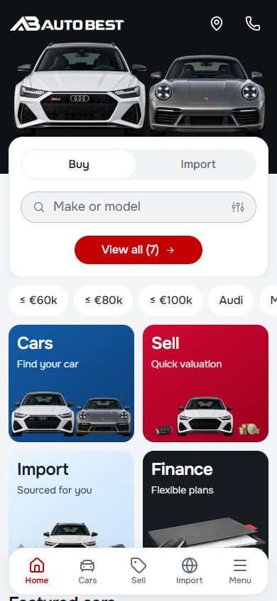
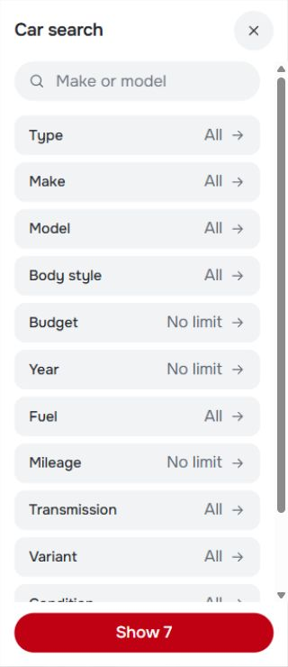
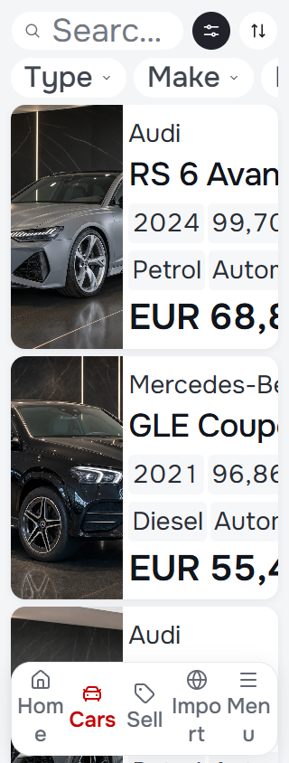
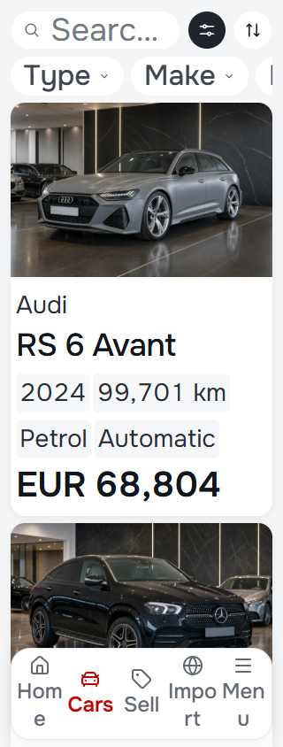
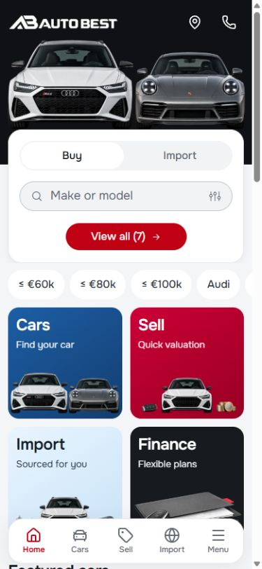
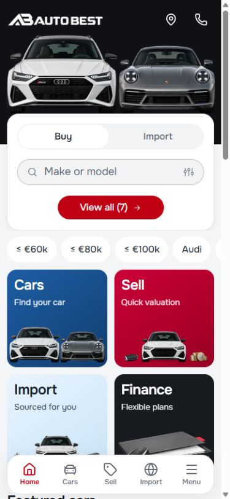
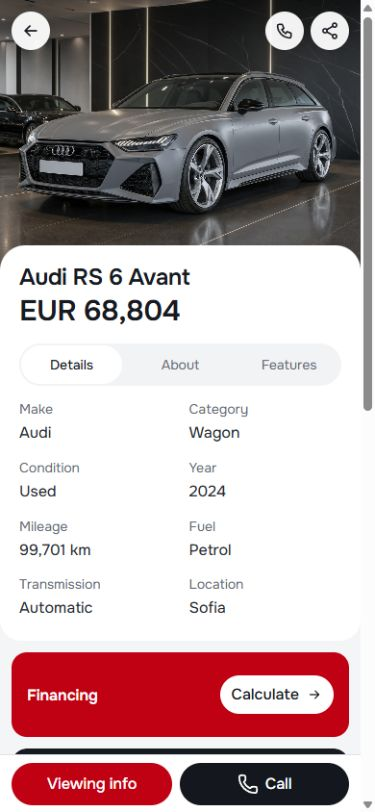
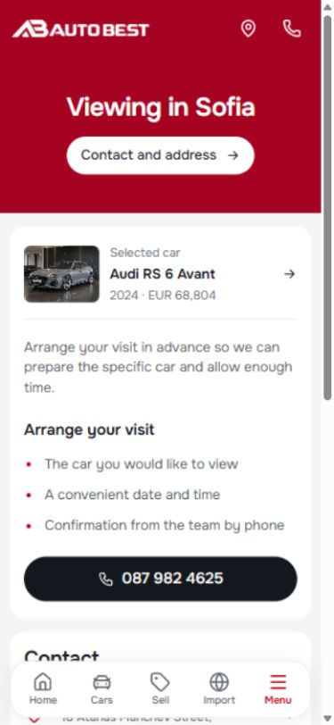

# Mobile audit and polish — 29 September 2026

Scope: the Auto Best reusable master, starting at `2cb6e6e6e` on Cars `main`, with the owner's existing homepage, catalog and finance edits present. Those pre-existing changes remain separate from this task's commit. No dealer release or deployment is included.

## Findings and changes

| Verified issue | Resolution |
| --- | --- |
| At 200% text, service descriptions overlapped artwork and the Finance title clipped. | Cards use content flow, retain a clear gap above artwork, and reflow to one column when enlarged text needs it. Artwork is constrained by both its aspect ratio and the available height. |
| Fixed-width entry actions and a fixed-height navigation bar could clip or collide with enlarged labels. | Entry action width scales in rem, text can wrap, and navigation height/clearance can grow. Standard controls retain their 44px touch target. |
| Footer-obscured navigation was transparent but still keyboard-focusable. | Hidden navigation is inert and has hidden visibility. Opening/closing the menu still restores focus. |
| Reduced-motion preference left page scrolling animated. | A shared reduced-motion rule also covers scroll and transition/animation duration. |
| Mobile layouts reserved a desktop scrollbar gutter, costing 15px in headless Chromium. | Mobile uses its available width; desktop retains its stable gutter. Scroll padding reserves clearance for the fixed actions. |
| Hidden service art downloaded eagerly and four below-fold vehicle photos claimed high priority. | The homepage does not render the mobile artwork inside its desktop banners. Decorative regions default to lazy loading; mobile hero art is explicitly prioritized; featured photos use their existing lazy policy. Desktop-only article art uses a media-qualified picture source. |

Three hidden homepage requests were eliminated: `service-car-v1.webp`, `menu-import-v2.webp`, and `menu-leasing-v2.webp`, totaling 605,268 transferred bytes in the initial baseline (about 591 KiB). This is a request-level improvement, not a claim about real-world LCP or a Lighthouse score. Dev and production font/logo compression differ, so their total transferred bytes are not directly comparable.

Onest remains self-hosted with Unicode subsets and `font-display: swap`. The pass preserves the established font scale, dealer logo variants, imagery and normal-size composition.

## Verification

Node 22.23.3, retained lockfile. Production browser checks use `http://127.0.0.1:5183`; the user's development URL is `http://127.0.0.1:5173/en/`.

- `npm run validate`: architecture, CSS policy, token graph, typography, assets, domain, localization, Svelte/TypeScript and production build. Svelte reported zero errors and zero warnings.
- `node scripts/mobile-final-smoke.mjs`: EN/BG at 320/390/430px, 200% text, actual artwork bounds, navigation targets, reduced motion, hidden dock focus, menu focus return and image request/priority contracts.
- `node scripts/mobile-polish-smoke.mjs`: EN/BG at 320/390/430/1440px, home/menu, inventory, filters, detail controls, short editors and settings.
- WebKit `overlay-controls-smoke.mjs`, cases `mobile-menu` and `import-form`: all 18 cases passed in EN/BG at the applicable 320/390/430/768/1440px widths.
- `route-smoke.mjs`: all 102 route/status/image/runtime/responsive cases passed, including EN/BG detail/article URLs, invalid URLs, zero results, 320px and short landscape.
- `enquiry-smoke.mjs`: sell/import validation, photos, review, share/copy, drafts and focus passed at 320/390/844/1440px, without server submissions. `mobile-filter-smoke.mjs`: all four viewport cases passed, including nested choices, draft cancellation and URL application.
- Axe-core: WCAG 2 A/AA, 2.1 AA and 2.2 AA rules across home, stock, vehicle detail, sell, import, finance, contact, about, guides and article at 320/390/430px in English. Final production scan: 30 cases, zero violations, zero runtime errors or page overflow. Form controls were at least 16px and no visible controls fell below 24px on either axis.

Initial development-server checks encountered module-fetch errors and a stalled desktop capture. Those runs are not acceptance evidence; final production checks supersede them. The stopped development listener was restored using the repository's preview helper and Node 22.

The broad suites preceded two final bounded corrections: constraining actual artwork height at 200% text and removing dormant mobile image nodes from the homepage banners. Repeated focused checks cover these final corrections. A repeat run exposed that lazy loading alone was not a deterministic guarantee against hidden image requests; the source omission resolves that cause rather than weakening the test.

## Evidence and limits

The retained before/after images use 390×844, loaded fonts, the same page position and returning English locale. `before-large-text.png` and `after-large-text.png` use a 200% root font size to exercise text resizing independently of viewport zoom.

| Before | After |
| --- | --- |
|  |  |
|  |  |

Automated scans do not establish complete WCAG conformance. Physical iOS/Android keyboard, screen-reader, safe-area and slow-network field tests remain unverified. At the end of this first pass, the wagon PNG and raster-backed logo remained media optimization opportunities. The supplementary pass below resolves their delivery size while retaining the originals. Existing business/demo data and enquiry delivery behavior are unchanged.

References: [WCAG 2.2](https://www.w3.org/TR/WCAG22/), [font loading](https://web.dev/articles/font-best-practices), [LCP resource priorities](https://web.dev/articles/optimize-lcp).

## Supplementary full mobile pass — 29–30 September 2026

The requested final mobile audit starts from Cars `0acaa3d952f195e6e3fb8e0d49cc7e98ea449087`, using the owner's development URL and the existing catalog/finance drafts. Implementation stays in the Auto Best master. The independently committed Modern, Carwow and Import work, pre-existing Auto Best changes, unrelated staged files and recovery evidence are preserved. Template promotion and dealer publication are outside this pass.

### Verified findings and fixes

| Finding | Result |
| --- | --- |
| Compact inventory rows clipped makes, models, specification chips and prices at 200% text. WebKit additionally clipped the card height after its content grew. | Text-relative container queries stack the image and copy when space is insufficient. Labels and chips wrap, currency can wrap separately from grouped digits, and mobile listing cards use intrinsic block height. Normal-size compact rows retain their composition. |
| Article cards and narrow browse/brand cards could lose enlarged labels. | Article cards can stack and text-bearing card regions wrap within their available width. |
| About/Contact hero heights and the detail grid could constrain enlarged content. | Mobile heroes grow with their contents; their actions retain their height. Detail grid tracks use a zero minimum and card copy can wrap. The detail action bar and page clearance grow with text. |
| Search sheets used inconsistent header spacing because component styles overrode shared styles. | Shared mobile dialog headers/search controls now win the cascade consistently. Headings, nested-picker actions and quick-search labels reflow. |
| Large text crowded import steps, enquiry footers and preference buttons. | Step markers scale with text; narrow import progress uses rows. Actions use intrinsic, wrapping layouts and language settings constrain their grid tracks without hiding overflow. |
| Trade-in helper/placeholder text and finance explanatory text had insufficient contrast. | They use the existing accessible muted token. Trade-in fields also receive the shared visible focus outline. |
| All filter fields reported expanded when just one nested choice was open. | Only the active field reports `aria-expanded=true`; closing the choice clears the expanded state. |
| Finance close and preferences opened through the mobile menu could return focus to the wrong or hidden control in WebKit. | Finance explicitly restores its visible opener. Closing the menu exposes its navigation trigger to preferences as the return target. |
| An unconfigured social group left empty menu spacing and an invalid labeled generic container. | Social links render only when configured, within a named group. |
| Logos, the wagon and oversized card imagery cost unnecessary mobile transfer. | Transparent lossless logo encodings, a smaller wagon encoding and source-matched responsive artwork/stock/blog variants reduce delivery size. The homepage hero preload uses the same source set and size hint as the rendered image. |
| Multiple small stylesheet requests blocked the first render. | SvelteKit inlines styles smaller than 32 KiB in its generated HTML. Larger layout/route sheets retain independent caching. This trades a modest increase in HTML size for fewer initial blocking requests. |

Onest remains self-hosted, subsetted and rendered with `font-display: swap`. The existing token scale is retained; the corrections make layouts adapt to that scale and text resizing. Responsive variants are registered by exact original source, so customized imagery keeps its own fallback. Originals, licenses and provenance remain available. [Encoding record](../../ASSET_PROVENANCE.md#mobile-delivery-encodings-2930-september-2026).

### Final verification

Node 22.20.0, retained npm lockfile. Browser suites use the production build at `http://127.0.0.1:5185`; interactive screenshots use the owner's development server at `http://127.0.0.1:5173`. Existing drafts are present in the tested worktree; the scoped commit excludes those drafts.

- `npm run validate` passes architecture, CSS policy, tokens, typography, assets, domain, localization, Svelte/TypeScript and production build; zero Svelte errors or warnings.
- `mobile-reflow-smoke.mjs`: all 66 cases pass in Chromium and all 66 in WebKit. EN/BG at 320/390/430px cover seven pages and four dialogs, normal text, 200% root text, WCAG text-spacing overrides, and 420px-high dialogs. Card copy, actions and horizontal overflow are checked separately.
- `route-smoke.mjs`: all 102 route/status/image/runtime/responsive cases pass, including mobile, desktop and short landscape. `mobile-polish-smoke.mjs` passes all eight locale/viewport cases. The six `mobile-final-smoke.mjs` cases also pass.
- `enquiry-smoke.mjs` passes its four viewport cases; `mobile-filter-smoke.mjs` passes all four cases, including nested draft cancellation and applied URLs. Enquiry tests use local share/copy fixtures and do not submit to a server.
- WebKit overlay controls: the 90-case matrix identified six finance focus-return failures; all six pass after the fix. The remaining 84 cases passed, and all ten nested-filter cases were repeated successfully after the expanded-state change.
- Axe-core WCAG A/AA rule scans: 72 page states, 48 overlay states and 32 nested-choice/form-step states report zero violations. Geometry also checks normal text, spacing overrides, enlarged text and short dialogs. Twenty-four affected page cases were repeated after the final inventory/detail/media corrections, with zero violations, page overflow or clipped actions. These scans cover EN/BG at 320/390/430px; nested filter fields and later enquiry steps receive additional 320px coverage.

The final full route and reflow reruns follow the last language-settings and stylesheet-delivery corrections. Earlier failures and their logs remain under ignored `artifacts/`; acceptance uses the passing reruns. Automated results establish the tested behavior, not complete WCAG conformance. Physical-device keyboards, assistive technology and safe-area behavior still need device testing.

### Loading measurement

Lighthouse 13.5.0 uses the same fresh-browser mobile simulation before and after: 412×823px at DPR 1.75, simulated slow 4G and 4× CPU slowdown, production `/en`, and Performance/Accessibility/Best Practices categories. Neither accepted report contains a runtime error or run warning.

| Metric | Before | Final build |
| --- | ---: | ---: |
| Performance | 69 | 81 |
| Accessibility / Best Practices | 100 / 100 | 100 / 100 |
| First Contentful Paint | 2.75s | 2.28s |
| Largest Contentful Paint | 9.58s | 4.59s |
| Total Blocking Time | 67ms | 108ms |
| Cumulative Layout Shift | 0.00045 | 0.00097 |
| Audited resource transfer | 3,635,887 bytes | 1,061,792 bytes |

The sampled transfer is 71% smaller and simulated LCP is 52% shorter. The wagon file itself falls from 1,151,143 to 34,610 bytes; the two transparent logo files total 32,106 bytes. Small-style inlining reduces initial external blocking stylesheets from nine to two and increases the HTML transfer from 27,642 to 33,261 bytes. The intermediate media-only run scored 81 with 2.64s FCP and 4.37s LCP; its report is retained alongside the final one. Blocking time and LCP vary between runs, so the inlining result supports earlier first paint, not an additional LCP improvement claim.

These are local lab samples, not field Core Web Vitals or a public deployment measurement. The final simulated LCP still needs improvement for slow connections. The remaining large initial JavaScript/catalog bundle and some body-type/photograph encodings are further optimization opportunities. Changing the translation architecture or pre-existing discovery drafts is outside this bounded polish pass. Preview cache-lifetime warnings do not establish production CDN behavior.

### Before/after evidence

Images retain the actual page pixels. The normal filter pair is 320×740; the enlarged inventory pair is 320×844 at 200% root text. Other pairs use the widths in their filenames, returning English preferences and loaded fonts. The inventory enlargement pair is cropped from the top of its original full-page captures without scaling or retouching.

| Before | After |
| --- | --- |
|  |  |
|  |  |
|  |  |
|  |  |
|  |  |

Additional after views: [menu](after-menu-390.jpg), [finance](after-finance-390.jpg), [footer](after-footer-390.jpg), and [normal 320px inventory](after-inventory-320.jpg).

References: [WCAG 2.2](https://www.w3.org/TR/WCAG22/), [fetch priority](https://web.dev/articles/fetch-priority), [LCP optimization](https://web.dev/articles/optimize-lcp).
