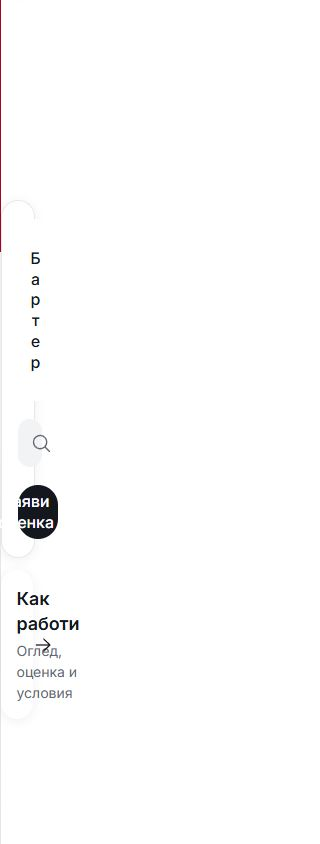

# Mobile segmented-control frame correction

The owner rejected the content-sized selector and reduced gray track from the preceding entry-hierarchy trial. This correction restores the previous balanced frame: two equal-width segments, a 44px gray surround and a white selected pill inset by 2px on every side. Switching selections preserves the pill geometry. The 48px mobile entry fields and existing compact actions remain.

This is mobile entry-control polish. Heroes, artwork, pinned Inter/Fluent assets, desktop composition and dealer publication are outside this change.

## Matched browser evidence

These are native in-app browser captures at 320 × 844 in Bulgarian. Before uses the preserved compiled trial; after uses the corrected compiled output. Both use the same page, viewport, loaded font, input state and scroll position. Each selector is captured in both states, including closing the automatic Import editor before the second-state capture.

| Page and selection | Before | After |
| --- | --- | --- |
| Home / Buy |  |  |
| Home / Import |  |  |
| Sell / Sale |  |  |
| Sell / Trade-in |  |  |
| Import / Listing |  |  |
| Import / Criteria |  |  |

## Verification

- `npm run check`: zero errors and warnings.
- `npm run build`: passed, including locale catalog and source checks.
- CSS policy, shared token and pinned typography/icon checks: passed.
- `scripts/shared-entry-smoke.mjs`: 8/8 EN/BG viewport cases at 320, 390, 768 and 1440px. Checks both selections, equal columns, visible inset, stable geometry, field/action targets, keyboard behavior, Import editor focus return, URL validation and prefill.
- Targeted `scripts/mobile-reflow-smoke.mjs`: 12/12 Home/Sell/Import EN/BG cases at 320/390px, including 200% text and text-spacing overrides.

Source hashes, browser measurements and complete focused reports are in [verification.json](verification.json). Compiled previews and intermediate evidence stay under ignored `runtime/`. Existing unrelated work is preserved. This record establishes local source/build/browser verification; owner visual acceptance and template/dealer release remain separate.
