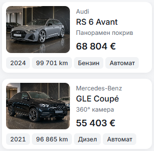

# Varied mobile inventory notes — 10 October 2026

The default note favored the panoramic-roof feature, which appears in all seven master fixtures. Each record now provides its own localized `cardNote`, selected from that record's listed equipment. The existing shared component and 12px muted note role remain unchanged.

| Vehicle | Bulgarian note | English note |
| --- | --- | --- |
| Audi RS 6 Avant | Панорамен покрив | Panoramic roof |
| Mercedes-Benz GLE Coupé | 360° камера | 360° camera |
| Audi RS Q8 | Адаптивен круиз | Adaptive cruise |
| BMW X6 M Sport | Безключов достъп | Keyless entry |
| Mercedes-AMG GT 4-Door | Навигация | Navigation |
| BMW X6 xDrive | 4×4 задвижване | All-wheel drive |
| Mercedes-AMG GT Coupé | Парктроник | Parking sensors |

Import and condition phrases remain available through `cardNote` when supplied for an individual car. This change adds no import/condition assertions and leaves the sample verification mode intact.

Focused preview checks passed for all seven BG/EN cards at 320px and with 200% text, plus BG at 390px. Every note and all four facts fit. Desktop card geometry and typography at 1440px match the pre-change measurements. Locale source audit reports no issues. The component is unchanged; its autofixer retains the known localized-link wrapper advisory. No production build or full test suite was repeated for this copy change.

| 320px before | 320px after |
| --- | --- |
|  |  |

`home-order-390.png` is the current home reference used to assess service priority. The recommendation is Services before Buying guides, retaining each card's action. Home order was inspected without a source change. `result.json` retains the compact verification; intermediate measurements were retired. The retained set is three captures, this explanation and the compact result.
